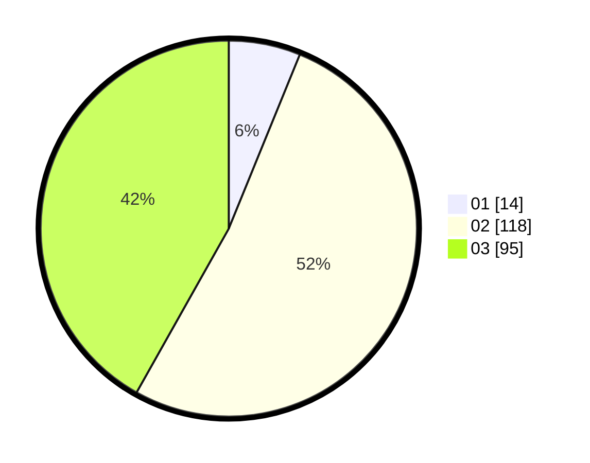

# Hasil

Hasil perolehan suara paslon dapat dilihat pada file paslon-01.txt, paslon-02.txt, dan paslon-03.txt.

Jika tidak ada, artinya data tersebut belum ada pada SIREKAP.

## Perolehan Suara

 * Paslon 01: **14**.
 * Paslon 02: **118**.
 * Paslon 03: **95**.

## Foto C Plano

https://sirekap-obj-formc.kpu.go.id/c0a5/pemilu/ppwp/31/72/05/10/01/3172051001055-20240217-174158--35131242-7c47-41c8-8a93-f353ddd71923.jpg

https://sirekap-obj-formc.kpu.go.id/c0a5/pemilu/ppwp/31/72/05/10/01/3172051001055-20240217-174742--2203ba69-ade6-4fa0-982d-b1d0c28678ca.jpg

https://sirekap-obj-formc.kpu.go.id/c0a5/pemilu/ppwp/31/72/05/10/01/3172051001055-20240217-174946--6e057231-e86a-4c31-810d-0f7e833b07c6.jpg

## DATA PEMILIH TETAP

Jumlah pemilih dalam DPT: **291**.
 * L: **126**.
 * P: **165**.

## DATA PENGGUNA HAK PILIH

Jumlah pengguna hak pilih dalam DPT: **212**.
 * L: **87**.
 * P: **125**.

Jumlah pengguna hak pilih dalam DPTb: **13**.
 * L: **9**.
 * P: **4**.

Jumlah pengguna hak pilih dalam DPK: **3**.
 * L: **1**.
 * P: **2**.

Jumlah pengguna hak pilih: **228**.
 * L: **97**.
 * P: **131**.

## JUMLAH SUARA SAH DAN TIDAK SAH

JUMLAH SELURUH SUARA SAH: **227**.

JUMLAH SUARA TIDAK SAH: **1**.

JUMLAH SELURUH SUARA SAH DAN SUARA TIDAK SAH: **228**.
