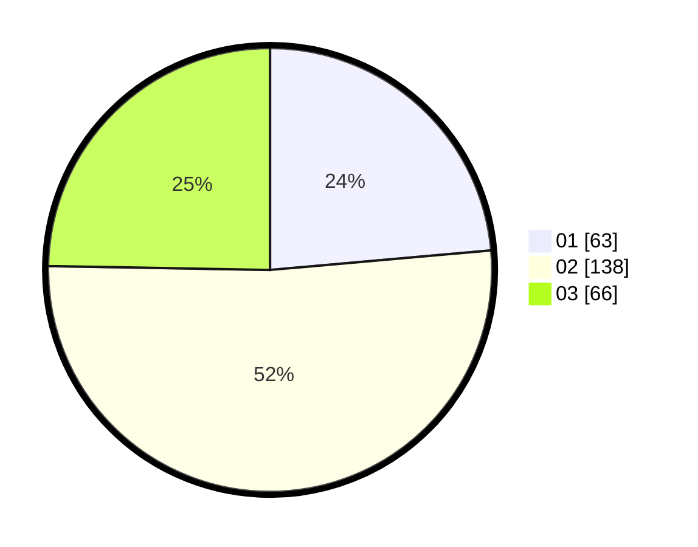

# Hasil

Hasil perolehan suara paslon dapat dilihat pada file paslon-01.txt, paslon-02.txt, dan paslon-03.txt.

Jika tidak ada, artinya data tersebut belum ada pada SIREKAP.

## Perolehan Suara

 * Paslon 01: **63**.
 * Paslon 02: **138**.
 * Paslon 03: **66**.

## Foto C Plano

https://sirekap-obj-formc.kpu.go.id/c661/pemilu/ppwp/31/72/05/10/01/3172051001095-20240214-185557--7bdaf7b8-5ea0-4ec1-b4a0-c43e64b6f9e7.jpg

https://sirekap-obj-formc.kpu.go.id/c661/pemilu/ppwp/31/72/05/10/01/3172051001095-20240214-190026--56844781-faa9-4527-ba5e-bcd92a0df74b.jpg

https://sirekap-obj-formc.kpu.go.id/c661/pemilu/ppwp/31/72/05/10/01/3172051001095-20240214-190134--448df717-8ecf-4ff9-b288-f5850bb5045a.jpg

## DATA PEMILIH TETAP

Jumlah pemilih dalam DPT: **292**.
 * L: **133**.
 * P: **159**.

## DATA PENGGUNA HAK PILIH

Jumlah pengguna hak pilih dalam DPT: **246**.
 * L: **110**.
 * P: **136**.

Jumlah pengguna hak pilih dalam DPTb: **22**.
 * L: **7**.
 * P: **15**.

Jumlah pengguna hak pilih dalam DPK: **5**.
 * L: **3**.
 * P: **2**.

Jumlah pengguna hak pilih: **273**.
 * L: **120**.
 * P: **153**.

## JUMLAH SUARA SAH DAN TIDAK SAH

JUMLAH SELURUH SUARA SAH: **267**.

JUMLAH SUARA TIDAK SAH: **6**.

JUMLAH SELURUH SUARA SAH DAN SUARA TIDAK SAH: **273**.
