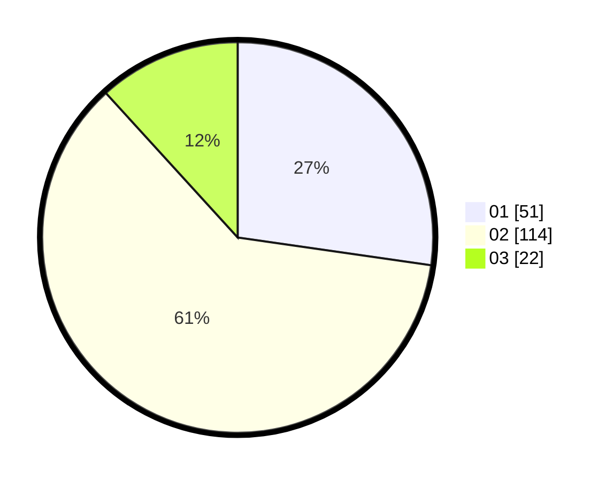

# Hasil

Hasil perolehan suara paslon dapat dilihat pada file paslon-01.txt, paslon-02.txt, dan paslon-03.txt.

Jika tidak ada, artinya data tersebut belum ada pada SIREKAP.

## Perolehan Suara

 * Paslon 01: **51**.
 * Paslon 02: **114**.
 * Paslon 03: **22**.

## Foto C Plano

https://sirekap-obj-formc.kpu.go.id/3b6e/pemilu/ppwp/31/72/05/10/01/3172051001115-20240215-020758--02545082-a72e-4dd0-8397-672515c99a1e.jpg

https://sirekap-obj-formc.kpu.go.id/3b6e/pemilu/ppwp/31/72/05/10/01/3172051001115-20240215-021017--f6a80d7f-bbf0-4cf1-9740-64739c5bb221.jpg

https://sirekap-obj-formc.kpu.go.id/3b6e/pemilu/ppwp/31/72/05/10/01/3172051001115-20240215-021138--36882a2c-4bae-4395-829d-7d19a93bdef4.jpg

## DATA PEMILIH TETAP

Jumlah pemilih dalam DPT: **252**.
 * L: **126**.
 * P: **126**.

## DATA PENGGUNA HAK PILIH

Jumlah pengguna hak pilih dalam DPT: **191**.
 * L: **87**.
 * P: **104**.

Jumlah pengguna hak pilih dalam DPTb: **0**.
 * L: **0**.
 * P: **0**.

Jumlah pengguna hak pilih dalam DPK: **1**.
 * L: **1**.
 * P: **0**.

Jumlah pengguna hak pilih: **192**.
 * L: **88**.
 * P: **104**.

## JUMLAH SUARA SAH DAN TIDAK SAH

JUMLAH SELURUH SUARA SAH: **187**.

JUMLAH SUARA TIDAK SAH: **5**.

JUMLAH SELURUH SUARA SAH DAN SUARA TIDAK SAH: **192**.
