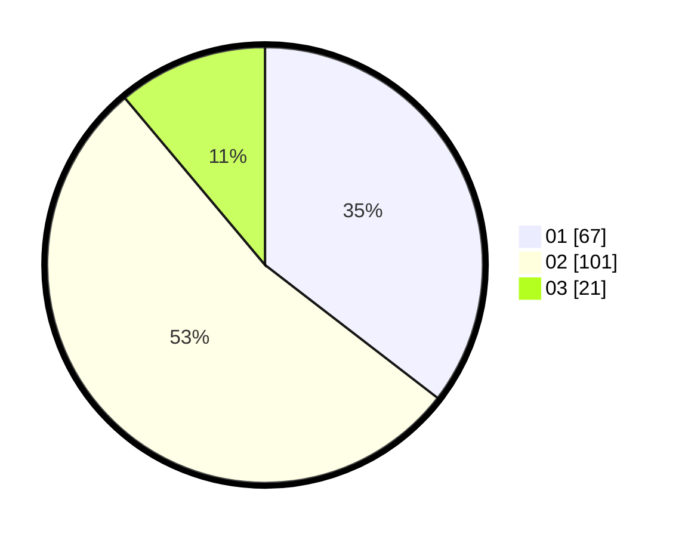

# Hasil

Hasil perolehan suara paslon dapat dilihat pada file paslon-01.txt, paslon-02.txt, dan paslon-03.txt.

Jika tidak ada, artinya data tersebut belum ada pada SIREKAP.

## Perolehan Suara

 * Paslon 01: **67**.
 * Paslon 02: **101**.
 * Paslon 03: **21**.

## Foto C Plano

https://sirekap-obj-formc.kpu.go.id/88d4/pemilu/ppwp/31/72/05/10/01/3172051001118-20240216-142933--18640339-e402-49a7-9b66-28785e959f62.jpg

https://sirekap-obj-formc.kpu.go.id/88d4/pemilu/ppwp/31/72/05/10/01/3172051001118-20240216-143358--75b65078-ceba-42c3-824d-4f0ba825bb35.jpg

https://sirekap-obj-formc.kpu.go.id/88d4/pemilu/ppwp/31/72/05/10/01/3172051001118-20240216-143748--504a208c-77c5-4771-a383-cc3768e617cc.jpg

## DATA PEMILIH TETAP

Jumlah pemilih dalam DPT: **291**.
 * L: **145**.
 * P: **146**.

## DATA PENGGUNA HAK PILIH

Jumlah pengguna hak pilih dalam DPT: **191**.
 * L: **94**.
 * P: **97**.

Jumlah pengguna hak pilih dalam DPTb: **1**.
 * L: **1**.
 * P: **0**.

Jumlah pengguna hak pilih dalam DPK: **2**.
 * L: **1**.
 * P: **1**.

Jumlah pengguna hak pilih: **194**.
 * L: **96**.
 * P: **98**.

## JUMLAH SUARA SAH DAN TIDAK SAH

JUMLAH SELURUH SUARA SAH: **189**.

JUMLAH SUARA TIDAK SAH: **5**.

JUMLAH SELURUH SUARA SAH DAN SUARA TIDAK SAH: **194**.
