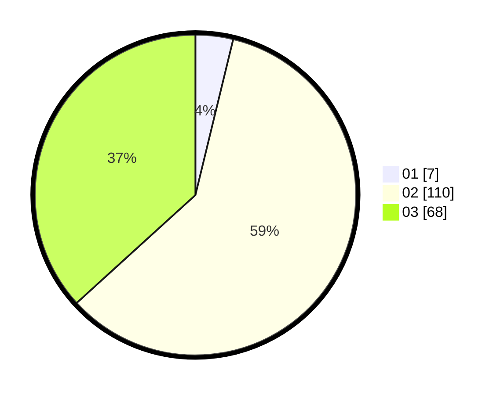

# Hasil

Hasil perolehan suara paslon dapat dilihat pada file paslon-01.txt, paslon-02.txt, dan paslon-03.txt.

Jika tidak ada, artinya data tersebut belum ada pada SIREKAP.

## Perolehan Suara

 * Paslon 01: **7**.
 * Paslon 02: **110**.
 * Paslon 03: **68**.

## Foto C Plano

https://sirekap-obj-formc.kpu.go.id/fb99/pemilu/ppwp/31/72/05/10/01/3172051001122-20240214-155857--ed5b8704-b55b-49b0-b067-8eb796286935.jpg

https://sirekap-obj-formc.kpu.go.id/fb99/pemilu/ppwp/31/72/05/10/01/3172051001122-20240214-160149--9b50cfe2-51fd-4cd6-9b38-6dad544093aa.jpg

https://sirekap-obj-formc.kpu.go.id/fb99/pemilu/ppwp/31/72/05/10/01/3172051001122-20240214-160151--29a15700-7d4b-4bd2-858c-423d636f6508.jpg
