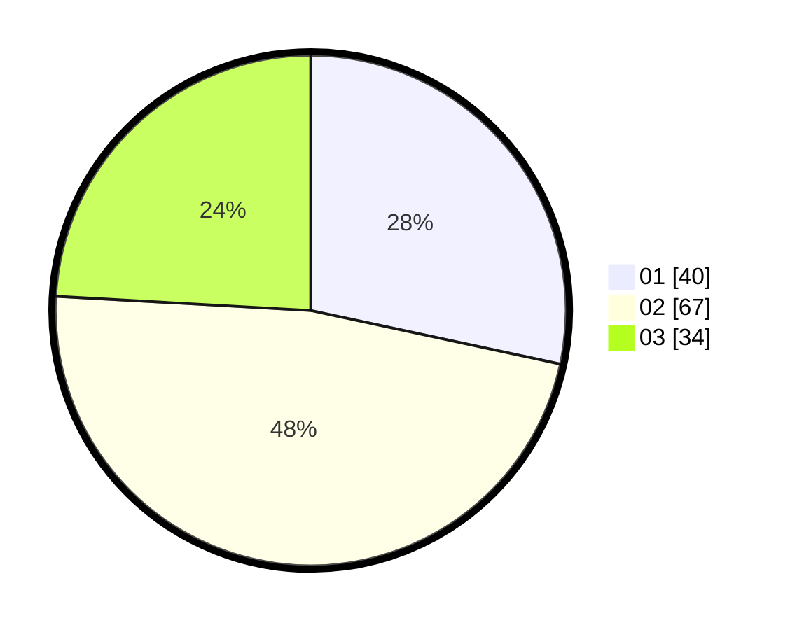

# Hasil

Hasil perolehan suara paslon dapat dilihat pada file paslon-01.txt, paslon-02.txt, dan paslon-03.txt.

Jika tidak ada, artinya data tersebut belum ada pada SIREKAP.

## Perolehan Suara

 * Paslon 01: **40**.
 * Paslon 02: **67**.
 * Paslon 03: **34**.

## Foto C Plano

https://sirekap-obj-formc.kpu.go.id/a321/pemilu/ppwp/31/72/05/10/02/3172051002001-20240217-173632--9201b68d-20e8-4224-a40a-266a23b14beb.jpg

https://sirekap-obj-formc.kpu.go.id/a321/pemilu/ppwp/31/72/05/10/02/3172051002001-20240217-174213--5e976a81-40db-446e-b3f3-37f61f3e4f3a.jpg

https://sirekap-obj-formc.kpu.go.id/a321/pemilu/ppwp/31/72/05/10/02/3172051002001-20240217-173809--ce3c3feb-bea0-4047-9266-44ae8645fdea.jpg

## DATA PEMILIH TETAP

Jumlah pemilih dalam DPT: **282**.
 * L: **131**.
 * P: **151**.

## DATA PENGGUNA HAK PILIH

Jumlah pengguna hak pilih dalam DPT: **145**.
 * L: **64**.
 * P: **81**.

Jumlah pengguna hak pilih dalam DPTb: **0**.
 * L: **0**.
 * P: **0**.

Jumlah pengguna hak pilih dalam DPK: **0**.
 * L: **0**.
 * P: **0**.

Jumlah pengguna hak pilih: **145**.
 * L: **64**.
 * P: **81**.

## JUMLAH SUARA SAH DAN TIDAK SAH

JUMLAH SELURUH SUARA SAH: **141**.

JUMLAH SUARA TIDAK SAH: **4**.

JUMLAH SELURUH SUARA SAH DAN SUARA TIDAK SAH: **145**.
