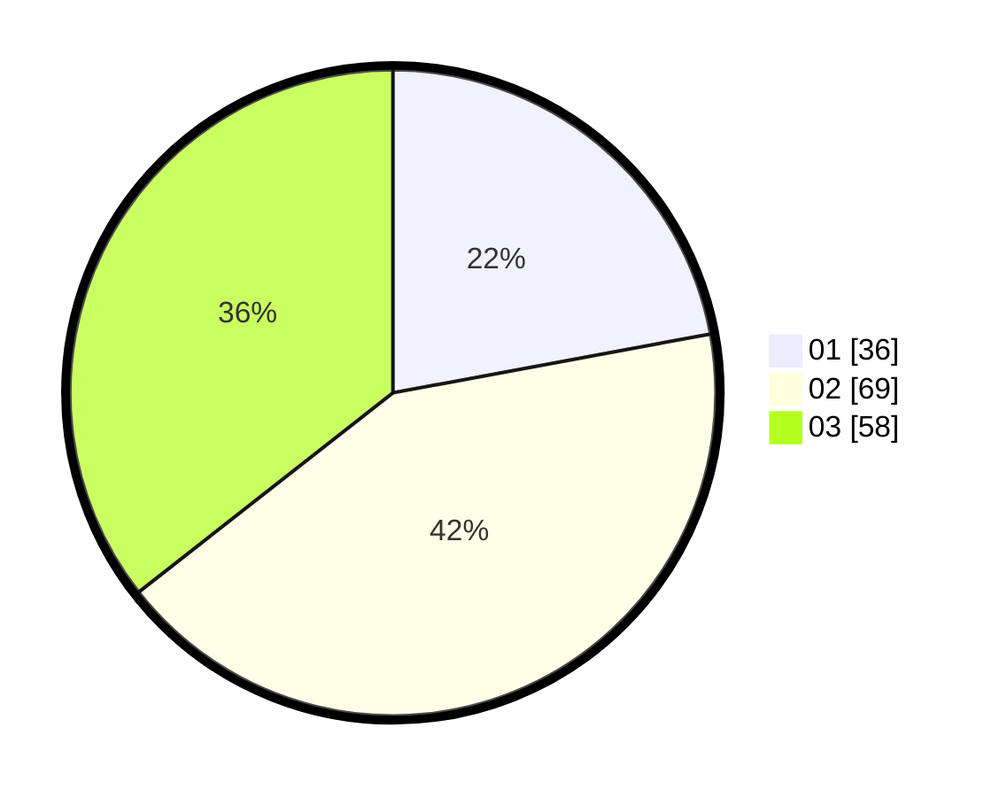

# Hasil

Hasil perolehan suara paslon dapat dilihat pada file paslon-01.txt, paslon-02.txt, dan paslon-03.txt.

Jika tidak ada, artinya data tersebut belum ada pada SIREKAP.

## Perolehan Suara

 * Paslon 01: **36**.
 * Paslon 02: **69**.
 * Paslon 03: **58**.

## Foto C Plano

https://sirekap-obj-formc.kpu.go.id/a97c/pemilu/ppwp/31/72/05/10/02/3172051002002-20240217-195358--b2549c9f-9947-4f86-b74d-8451bdc7d387.jpg

https://sirekap-obj-formc.kpu.go.id/a97c/pemilu/ppwp/31/72/05/10/02/3172051002002-20240217-211405--037d09f0-5f18-47b0-bdc9-3209513a23ae.jpg

https://sirekap-obj-formc.kpu.go.id/a97c/pemilu/ppwp/31/72/05/10/02/3172051002002-20240217-195843--5c65f390-ef18-406a-bed7-fec5690a7b0f.jpg

## DATA PEMILIH TETAP

Jumlah pemilih dalam DPT: **282**.
 * L: **143**.
 * P: **139**.

## DATA PENGGUNA HAK PILIH

Jumlah pengguna hak pilih dalam DPT: **161**.
 * L: **84**.
 * P: **77**.

Jumlah pengguna hak pilih dalam DPTb: **0**.
 * L: **0**.
 * P: **0**.

Jumlah pengguna hak pilih dalam DPK: **2**.
 * L: **0**.
 * P: **2**.

Jumlah pengguna hak pilih: **163**.
 * L: **84**.
 * P: **79**.

## JUMLAH SUARA SAH DAN TIDAK SAH

JUMLAH SELURUH SUARA SAH: **163**.

JUMLAH SUARA TIDAK SAH: **1**.

JUMLAH SELURUH SUARA SAH DAN SUARA TIDAK SAH: **164**.
