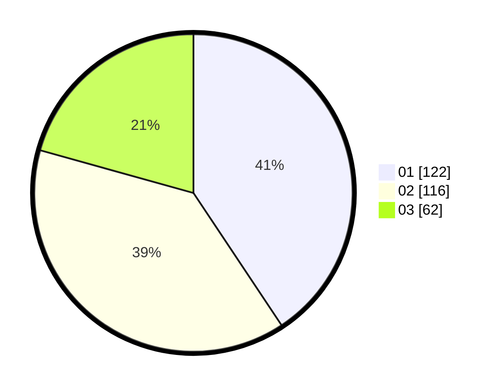

# Hasil

Hasil perolehan suara paslon dapat dilihat pada file paslon-01.txt, paslon-02.txt, dan paslon-03.txt.

Jika tidak ada, artinya data tersebut belum ada pada SIREKAP.

## Perolehan Suara

 * Paslon 01: **122**.
 * Paslon 02: **116**.
 * Paslon 03: **62**.

## Foto C Plano

https://sirekap-obj-formc.kpu.go.id/c07d/pemilu/ppwp/31/72/05/10/02/3172051002018-20240215-013529--bce79453-ceec-4b72-832a-7b67483ac337.jpg

https://sirekap-obj-formc.kpu.go.id/c07d/pemilu/ppwp/31/72/05/10/02/3172051002018-20240215-013535--ff4c4c45-73ee-4e54-b978-7adb9aaa7561.jpg

https://sirekap-obj-formc.kpu.go.id/c07d/pemilu/ppwp/31/72/05/10/02/3172051002018-20240215-013542--43e857e4-3664-455c-86eb-952e39a7ae68.jpg

## DATA PEMILIH TETAP

Jumlah pemilih dalam DPT: **266**.
 * L: **139**.
 * P: **127**.

## DATA PENGGUNA HAK PILIH

Jumlah pengguna hak pilih dalam DPT: **203**.
 * L: **105**.
 * P: **98**.

Jumlah pengguna hak pilih dalam DPTb: **0**.
 * L: **0**.
 * P: **0**.

Jumlah pengguna hak pilih dalam DPK: **1**.
 * L: **1**.
 * P: **0**.

Jumlah pengguna hak pilih: **204**.
 * L: **106**.
 * P: **98**.

## JUMLAH SUARA SAH DAN TIDAK SAH

JUMLAH SELURUH SUARA SAH: **200**.

JUMLAH SUARA TIDAK SAH: **4**.

JUMLAH SELURUH SUARA SAH DAN SUARA TIDAK SAH: **204**.
