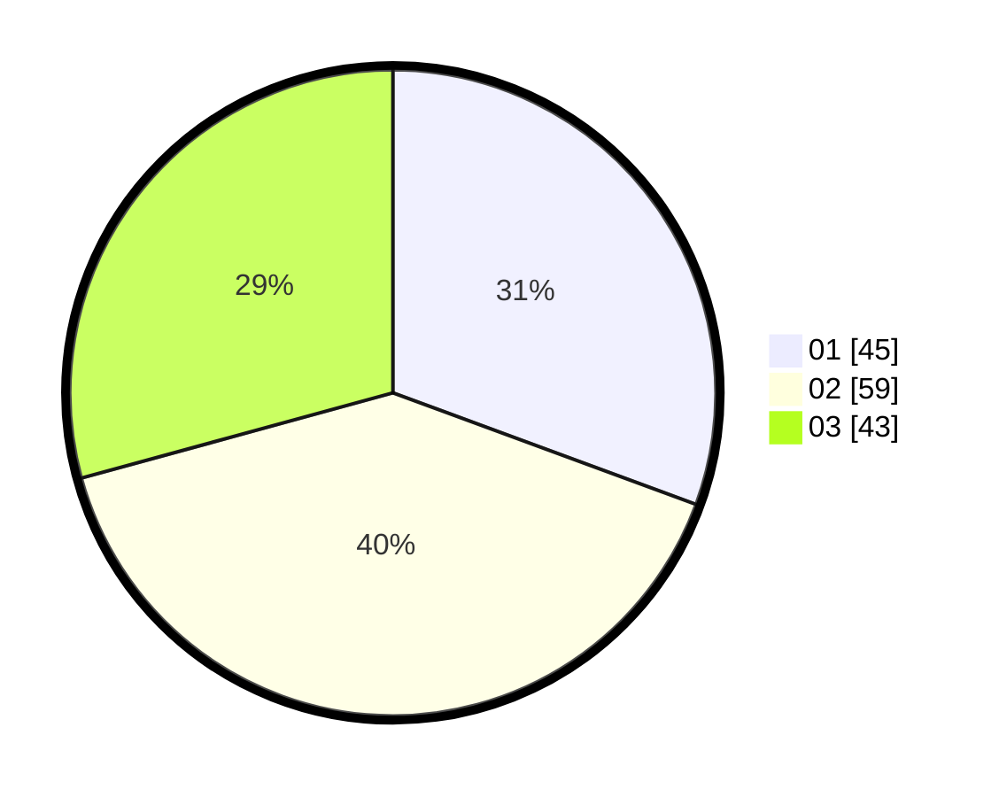

# Hasil

Hasil perolehan suara paslon dapat dilihat pada file paslon-01.txt, paslon-02.txt, dan paslon-03.txt.

Jika tidak ada, artinya data tersebut belum ada pada SIREKAP.

## Perolehan Suara

 * Paslon 01: **45**.
 * Paslon 02: **59**.
 * Paslon 03: **43**.

## Foto C Plano

https://sirekap-obj-formc.kpu.go.id/8b18/pemilu/ppwp/31/72/05/10/02/3172051002027-20240214-155447--f757dceb-62e1-4575-931a-27ba9d08f3a4.jpg

https://sirekap-obj-formc.kpu.go.id/8b18/pemilu/ppwp/31/72/05/10/02/3172051002027-20240214-155600--411df378-d7d0-4966-b011-ff355500f114.jpg

https://sirekap-obj-formc.kpu.go.id/8b18/pemilu/ppwp/31/72/05/10/02/3172051002027-20240214-155608--67a371b5-b558-4ef5-86b3-c533806c4549.jpg

## DATA PEMILIH TETAP

Jumlah pemilih dalam DPT: **281**.
 * L: **142**.
 * P: **139**.

## DATA PENGGUNA HAK PILIH

Jumlah pengguna hak pilih dalam DPT: **150**.
 * L: **77**.
 * P: **77**.

Jumlah pengguna hak pilih dalam DPTb: **0**.
 * L: **0**.
 * P: **0**.

Jumlah pengguna hak pilih dalam DPK: **0**.
 * L: **0**.
 * P: **0**.

Jumlah pengguna hak pilih: **150**.
 * L: **77**.
 * P: **77**.

## JUMLAH SUARA SAH DAN TIDAK SAH

JUMLAH SELURUH SUARA SAH: **147**.

JUMLAH SUARA TIDAK SAH: **3**.

JUMLAH SELURUH SUARA SAH DAN SUARA TIDAK SAH: **150**.
