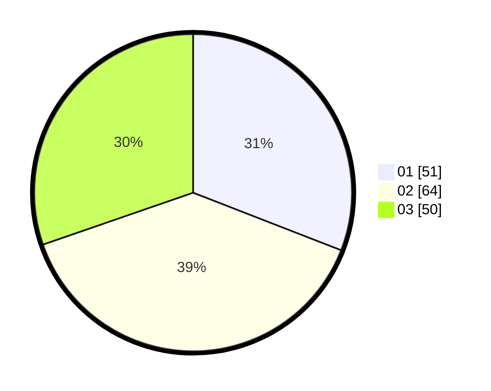

# Hasil

Hasil perolehan suara paslon dapat dilihat pada file paslon-01.txt, paslon-02.txt, dan paslon-03.txt.

Jika tidak ada, artinya data tersebut belum ada pada SIREKAP.

## Perolehan Suara

 * Paslon 01: **51**.
 * Paslon 02: **64**.
 * Paslon 03: **50**.

## Foto C Plano

https://sirekap-obj-formc.kpu.go.id/e06b/pemilu/ppwp/31/72/05/10/02/3172051002028-20240215-183550--c697813c-7f2d-49cd-b217-47ab19045d54.jpg

https://sirekap-obj-formc.kpu.go.id/e06b/pemilu/ppwp/31/72/05/10/02/3172051002028-20240215-183909--d0c77114-e7ea-490a-a0a4-260eb722044c.jpg

https://sirekap-obj-formc.kpu.go.id/e06b/pemilu/ppwp/31/72/05/10/02/3172051002028-20240215-184043--23e7dd24-4a91-434e-9133-0b55d0d4d36c.jpg
