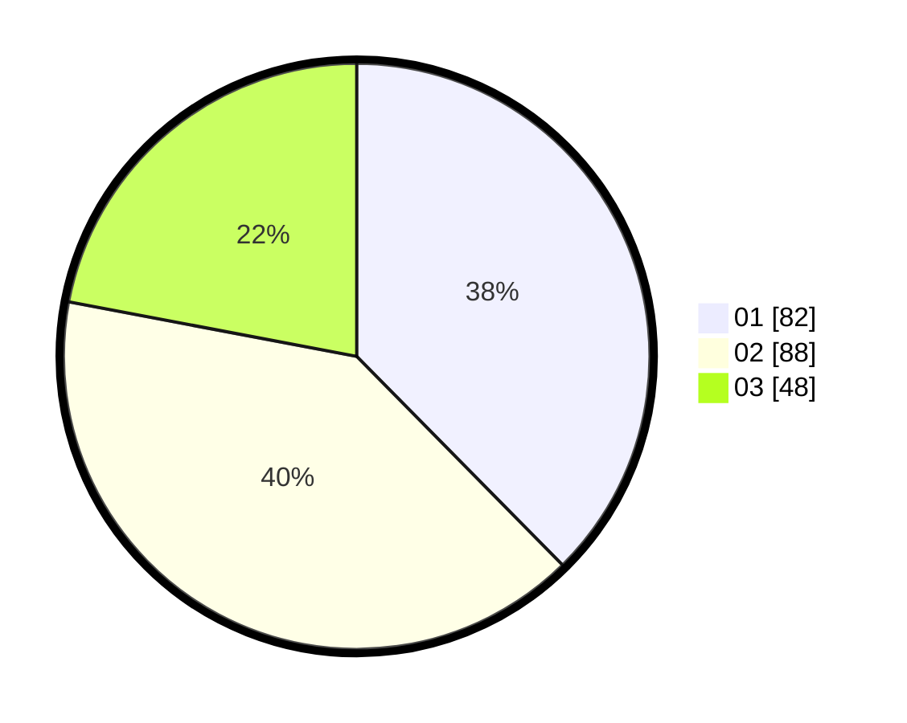

# Hasil

Hasil perolehan suara paslon dapat dilihat pada file paslon-01.txt, paslon-02.txt, dan paslon-03.txt.

Jika tidak ada, artinya data tersebut belum ada pada SIREKAP.

## Perolehan Suara

 * Paslon 01: **82**.
 * Paslon 02: **88**.
 * Paslon 03: **48**.

## Foto C Plano

https://sirekap-obj-formc.kpu.go.id/4289/pemilu/ppwp/31/72/05/10/02/3172051002036-20240214-155051--2cd868d8-d263-4ff3-bdc1-6708ce79c365.jpg

https://sirekap-obj-formc.kpu.go.id/4289/pemilu/ppwp/31/72/05/10/02/3172051002036-20240214-192348--9b0bea51-8bd0-49ee-9259-d4590ed311df.jpg

https://sirekap-obj-formc.kpu.go.id/4289/pemilu/ppwp/31/72/05/10/02/3172051002036-20240214-155543--5e969cec-ab20-44b5-a235-cbb0ce3c226d.jpg

## DATA PEMILIH TETAP

Jumlah pemilih dalam DPT: **268**.
 * L: **139**.
 * P: **129**.

## DATA PENGGUNA HAK PILIH

Jumlah pengguna hak pilih dalam DPT: **216**.
 * L: **112**.
 * P: **104**.

Jumlah pengguna hak pilih dalam DPTb: **0**.
 * L: **0**.
 * P: **0**.

Jumlah pengguna hak pilih dalam DPK: **4**.
 * L: **1**.
 * P: **3**.

Jumlah pengguna hak pilih: **220**.
 * L: **113**.
 * P: **107**.

## JUMLAH SUARA SAH DAN TIDAK SAH

JUMLAH SELURUH SUARA SAH: **218**.

JUMLAH SUARA TIDAK SAH: **2**.

JUMLAH SELURUH SUARA SAH DAN SUARA TIDAK SAH: **220**.
