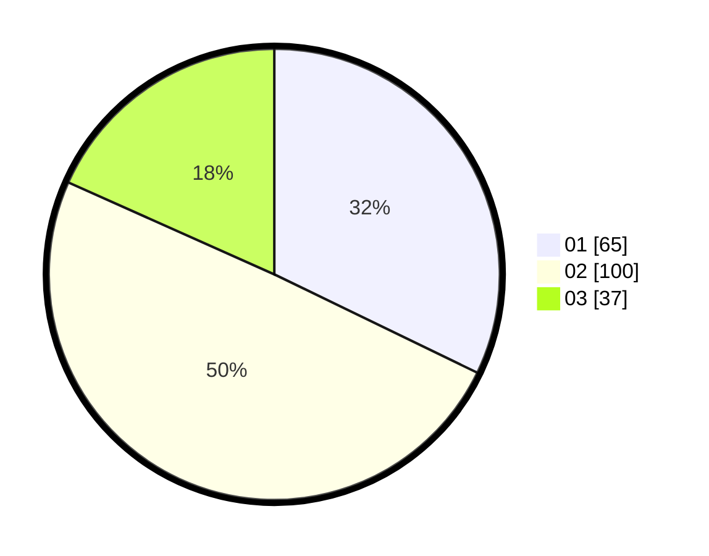

# Hasil

Hasil perolehan suara paslon dapat dilihat pada file paslon-01.txt, paslon-02.txt, dan paslon-03.txt.

Jika tidak ada, artinya data tersebut belum ada pada SIREKAP.

## Perolehan Suara

 * Paslon 01: **65**.
 * Paslon 02: **100**.
 * Paslon 03: **37**.

## Foto C Plano

https://sirekap-obj-formc.kpu.go.id/e7ae/pemilu/ppwp/31/72/05/10/02/3172051002041-20240214-202701--ff20d3fe-a4e0-451c-a740-0b2f4a835acc.jpg

https://sirekap-obj-formc.kpu.go.id/e7ae/pemilu/ppwp/31/72/05/10/02/3172051002041-20240216-081318--9359f4c1-9a34-4a4a-8ec5-e4e4bda8fb95.jpg

https://sirekap-obj-formc.kpu.go.id/e7ae/pemilu/ppwp/31/72/05/10/02/3172051002041-20240214-202753--cd7984bb-f4a0-4e1f-b98c-10e0d71bbab3.jpg

## DATA PEMILIH TETAP

Jumlah pemilih dalam DPT: **289**.
 * L: **140**.
 * P: **149**.

## DATA PENGGUNA HAK PILIH

Jumlah pengguna hak pilih dalam DPT: **202**.
 * L: **91**.
 * P: **111**.

Jumlah pengguna hak pilih dalam DPTb: **1**.
 * L: **0**.
 * P: **1**.

Jumlah pengguna hak pilih dalam DPK: **1**.
 * L: **0**.
 * P: **1**.

Jumlah pengguna hak pilih: **204**.
 * L: **91**.
 * P: **113**.

## JUMLAH SUARA SAH DAN TIDAK SAH

JUMLAH SELURUH SUARA SAH: **202**.

JUMLAH SUARA TIDAK SAH: **2**.

JUMLAH SELURUH SUARA SAH DAN SUARA TIDAK SAH: **204**.
