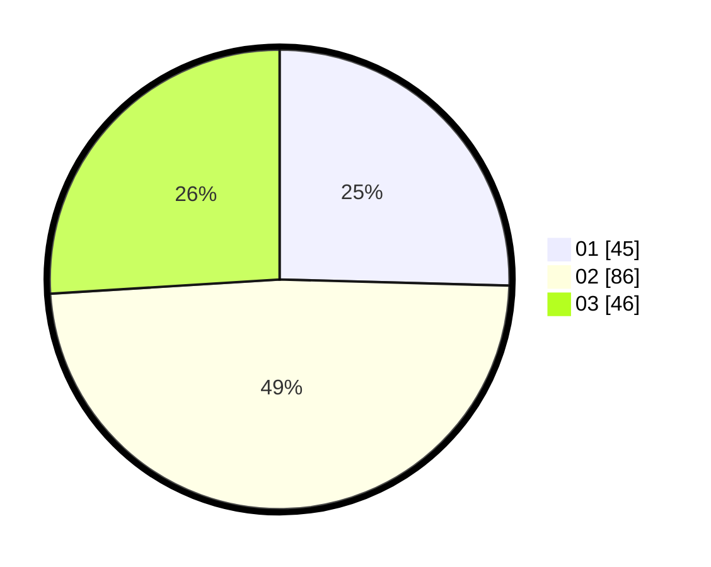

# Hasil

Hasil perolehan suara paslon dapat dilihat pada file paslon-01.txt, paslon-02.txt, dan paslon-03.txt.

Jika tidak ada, artinya data tersebut belum ada pada SIREKAP.

## Perolehan Suara

 * Paslon 01: **45**.
 * Paslon 02: **86**.
 * Paslon 03: **46**.

## Foto C Plano

https://sirekap-obj-formc.kpu.go.id/5eb7/pemilu/ppwp/31/72/05/10/02/3172051002053-20240214-162236--270c62cd-707b-42ff-b3a1-5b0fcd93469e.jpg

https://sirekap-obj-formc.kpu.go.id/5eb7/pemilu/ppwp/31/72/05/10/02/3172051002053-20240214-162239--fd1e09d7-081c-4c3a-8a19-93186fd1cd26.jpg

https://sirekap-obj-formc.kpu.go.id/5eb7/pemilu/ppwp/31/72/05/10/02/3172051002053-20240214-162246--318b03e9-cb66-48d4-a0f3-e5fc888f90e7.jpg

## DATA PEMILIH TETAP

Jumlah pemilih dalam DPT: **265**.
 * L: **123**.
 * P: **142**.

## DATA PENGGUNA HAK PILIH

Jumlah pengguna hak pilih dalam DPT: **177**.
 * L: **82**.
 * P: **95**.

Jumlah pengguna hak pilih dalam DPTb: **1**.
 * L: **1**.
 * P: **0**.

Jumlah pengguna hak pilih dalam DPK: **1**.
 * L: **0**.
 * P: **1**.

Jumlah pengguna hak pilih: **179**.
 * L: **83**.
 * P: **96**.

## JUMLAH SUARA SAH DAN TIDAK SAH

JUMLAH SELURUH SUARA SAH: **177**.

JUMLAH SUARA TIDAK SAH: **2**.

JUMLAH SELURUH SUARA SAH DAN SUARA TIDAK SAH: **179**.
