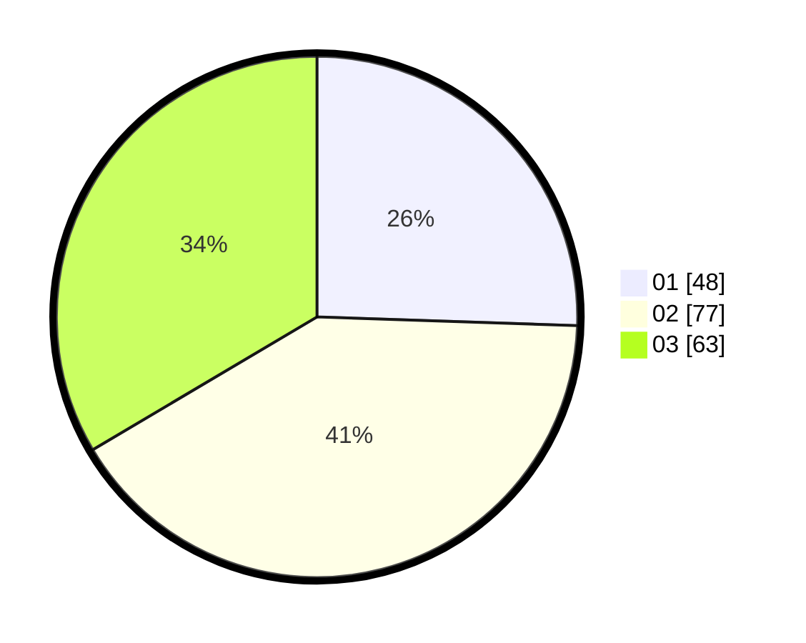

# Hasil

Hasil perolehan suara paslon dapat dilihat pada file paslon-01.txt, paslon-02.txt, dan paslon-03.txt.

Jika tidak ada, artinya data tersebut belum ada pada SIREKAP.

## Perolehan Suara

 * Paslon 01: **48**.
 * Paslon 02: **77**.
 * Paslon 03: **63**.

## Foto C Plano

https://sirekap-obj-formc.kpu.go.id/87ab/pemilu/ppwp/31/72/05/10/02/3172051002056-20240214-233101--056469fa-5e2b-4054-a5a5-236420502cbd.jpg

https://sirekap-obj-formc.kpu.go.id/87ab/pemilu/ppwp/31/72/05/10/02/3172051002056-20240214-233105--e5cbbafa-cc20-4d9a-87f3-f43c4bc974b7.jpg

https://sirekap-obj-formc.kpu.go.id/87ab/pemilu/ppwp/31/72/05/10/02/3172051002056-20240214-233108--a2f74254-6b8a-4ff9-be2c-3f15cde78978.jpg
