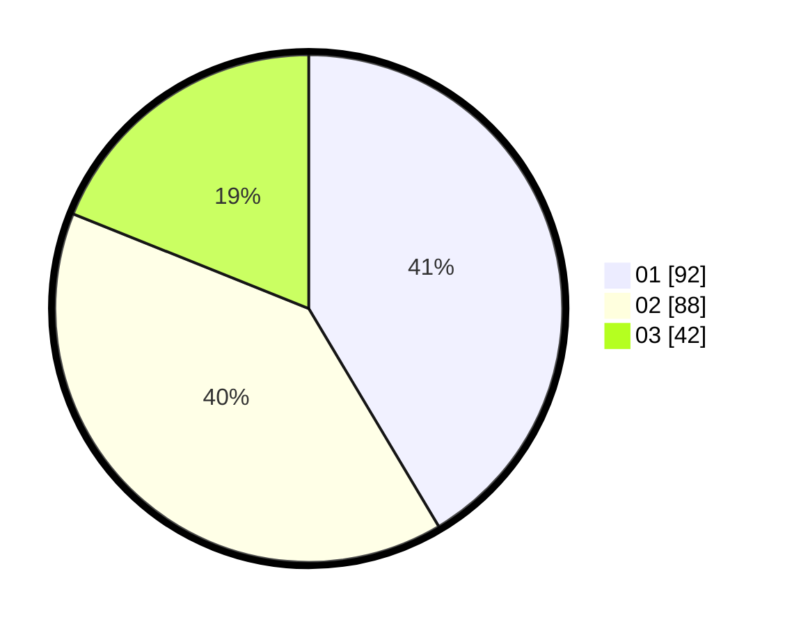

# Hasil

Hasil perolehan suara paslon dapat dilihat pada file paslon-01.txt, paslon-02.txt, dan paslon-03.txt.

Jika tidak ada, artinya data tersebut belum ada pada SIREKAP.

## Perolehan Suara

 * Paslon 01: **92**.
 * Paslon 02: **88**.
 * Paslon 03: **42**.

## Foto C Plano

https://sirekap-obj-formc.kpu.go.id/c60d/pemilu/ppwp/31/72/05/10/02/3172051002064-20240214-201913--ab86d95b-9500-4a63-8123-a9a3776253fe.jpg

https://sirekap-obj-formc.kpu.go.id/c60d/pemilu/ppwp/31/72/05/10/02/3172051002064-20240214-202000--8c93b569-b169-4697-a28e-7362ca7d5221.jpg

https://sirekap-obj-formc.kpu.go.id/c60d/pemilu/ppwp/31/72/05/10/02/3172051002064-20240214-202021--043596ac-b494-4a08-908e-9bc0fe92a684.jpg

## DATA PEMILIH TETAP

Jumlah pemilih dalam DPT: **287**.
 * L: **149**.
 * P: **138**.

## DATA PENGGUNA HAK PILIH

Jumlah pengguna hak pilih dalam DPT: **223**.
 * L: **112**.
 * P: **111**.

Jumlah pengguna hak pilih dalam DPTb: **2**.
 * L: **0**.
 * P: **2**.

Jumlah pengguna hak pilih dalam DPK: **0**.
 * L: **0**.
 * P: **0**.

Jumlah pengguna hak pilih: **225**.
 * L: **112**.
 * P: **113**.

## JUMLAH SUARA SAH DAN TIDAK SAH

JUMLAH SELURUH SUARA SAH: **222**.

JUMLAH SUARA TIDAK SAH: **3**.

JUMLAH SELURUH SUARA SAH DAN SUARA TIDAK SAH: **225**.
