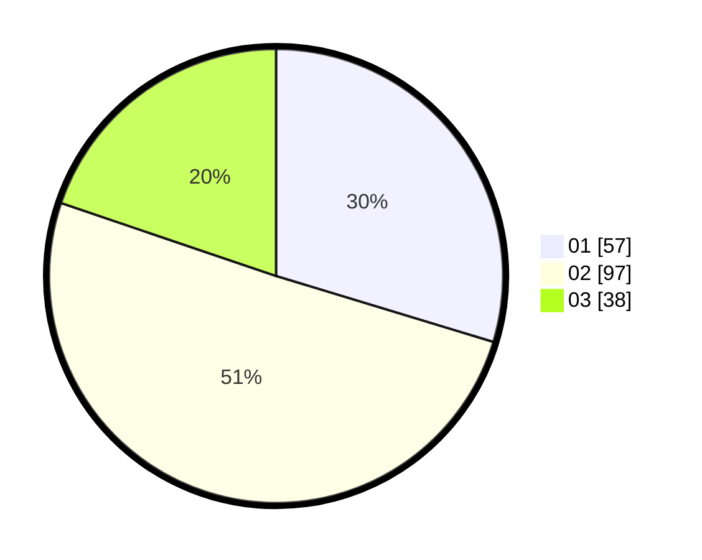

# Hasil

Hasil perolehan suara paslon dapat dilihat pada file paslon-01.txt, paslon-02.txt, dan paslon-03.txt.

Jika tidak ada, artinya data tersebut belum ada pada SIREKAP.

## Perolehan Suara

 * Paslon 01: **57**.
 * Paslon 02: **97**.
 * Paslon 03: **38**.

## Foto C Plano

https://sirekap-obj-formc.kpu.go.id/4799/pemilu/ppwp/31/72/05/10/02/3172051002065-20240214-230552--e34796d0-2212-4b27-9d87-6b59e3890e66.jpg

https://sirekap-obj-formc.kpu.go.id/4799/pemilu/ppwp/31/72/05/10/02/3172051002065-20240214-230623--b02a8d36-f4c2-4f2c-b079-94e3a1c402d4.jpg

https://sirekap-obj-formc.kpu.go.id/4799/pemilu/ppwp/31/72/05/10/02/3172051002065-20240214-230702--20a819b8-6dbc-4f2e-9433-81f0a7e36ab2.jpg
