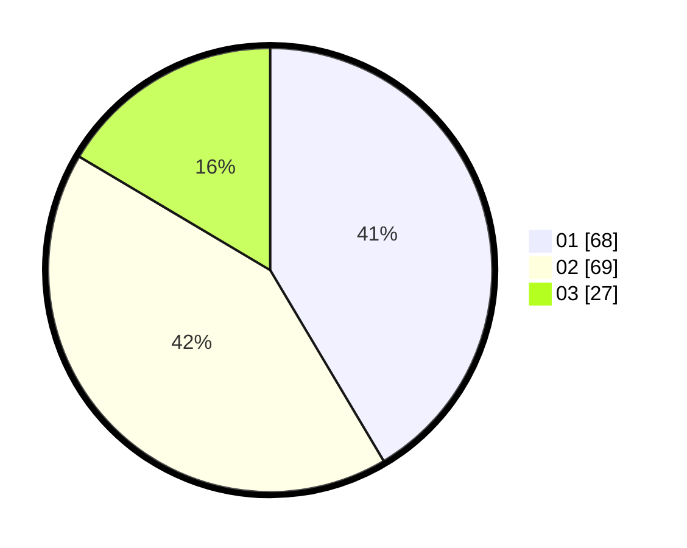

# Hasil

Hasil perolehan suara paslon dapat dilihat pada file paslon-01.txt, paslon-02.txt, dan paslon-03.txt.

Jika tidak ada, artinya data tersebut belum ada pada SIREKAP.

## Perolehan Suara

 * Paslon 01: **68**.
 * Paslon 02: **69**.
 * Paslon 03: **27**.

## Foto C Plano

https://sirekap-obj-formc.kpu.go.id/84ac/pemilu/ppwp/31/72/05/10/02/3172051002078-20240215-024025--92fcc48a-0c93-4405-a2dc-cbef8d2d599f.jpg

https://sirekap-obj-formc.kpu.go.id/84ac/pemilu/ppwp/31/72/05/10/02/3172051002078-20240215-024018--cbb7236b-5415-47fd-92ce-b4f7d35c5b4e.jpg
