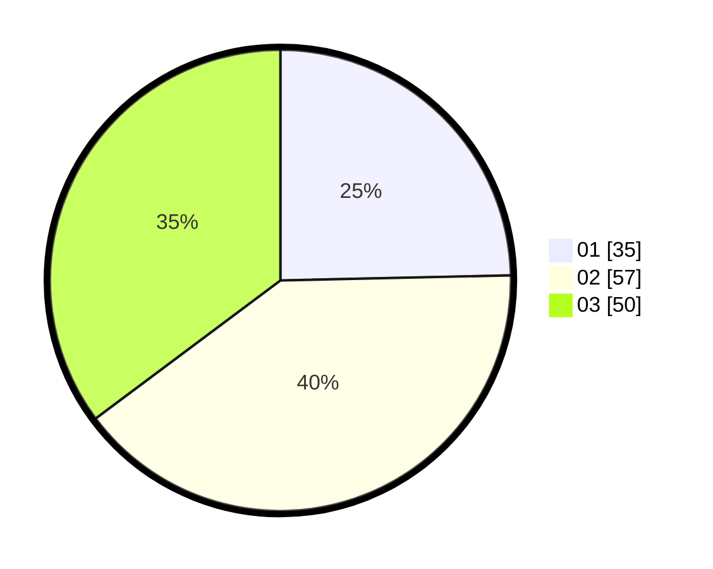

# Hasil

Hasil perolehan suara paslon dapat dilihat pada file paslon-01.txt, paslon-02.txt, dan paslon-03.txt.

Jika tidak ada, artinya data tersebut belum ada pada SIREKAP.

## Perolehan Suara

 * Paslon 01: **35**.
 * Paslon 02: **57**.
 * Paslon 03: **50**.

## Foto C Plano

https://sirekap-obj-formc.kpu.go.id/ebb4/pemilu/ppwp/31/72/05/10/02/3172051002088-20240214-155107--47a1f0bd-9019-461f-894e-789394ea1957.jpg

https://sirekap-obj-formc.kpu.go.id/ebb4/pemilu/ppwp/31/72/05/10/02/3172051002088-20240214-155856--a7ac797f-1dbf-4764-b5e1-dfaf54171734.jpg

https://sirekap-obj-formc.kpu.go.id/ebb4/pemilu/ppwp/31/72/05/10/02/3172051002088-20240215-145439--fdc0772c-ac92-4ae9-b440-1101ad251de9.jpg
