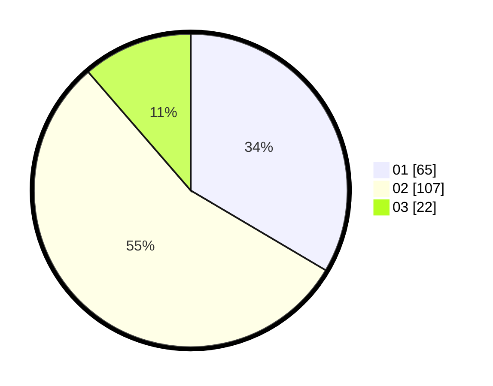

# Hasil

Hasil perolehan suara paslon dapat dilihat pada file paslon-01.txt, paslon-02.txt, dan paslon-03.txt.

Jika tidak ada, artinya data tersebut belum ada pada SIREKAP.

## Perolehan Suara

 * Paslon 01: **65**.
 * Paslon 02: **107**.
 * Paslon 03: **22**.

## Foto C Plano

https://sirekap-obj-formc.kpu.go.id/1d6c/pemilu/ppwp/31/72/05/10/02/3172051002090-20240214-194616--0dbf3d2e-dd82-4820-8ec9-ad0bddd304ff.jpg

https://sirekap-obj-formc.kpu.go.id/1d6c/pemilu/ppwp/31/72/05/10/02/3172051002090-20240214-193815--1d940964-4c29-4c94-a14d-65047ffae39b.jpg

https://sirekap-obj-formc.kpu.go.id/1d6c/pemilu/ppwp/31/72/05/10/02/3172051002090-20240214-194001--01be48ee-4e29-457b-b988-ba6a501a294b.jpg
