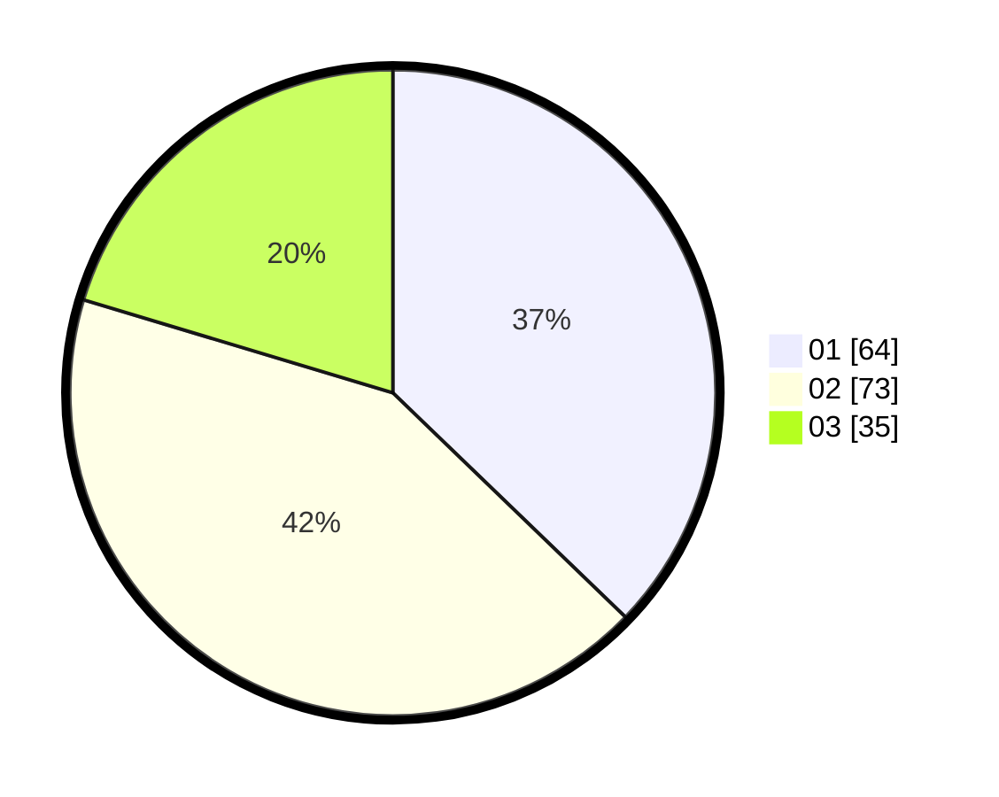

# Hasil

Hasil perolehan suara paslon dapat dilihat pada file paslon-01.txt, paslon-02.txt, dan paslon-03.txt.

Jika tidak ada, artinya data tersebut belum ada pada SIREKAP.

## Perolehan Suara

 * Paslon 01: **64**.
 * Paslon 02: **73**.
 * Paslon 03: **35**.

## Foto C Plano

https://sirekap-obj-formc.kpu.go.id/c336/pemilu/ppwp/31/72/05/10/02/3172051002101-20240218-143247--2261b52e-67c1-423a-a6e6-9163f96fc5e7.jpg

https://sirekap-obj-formc.kpu.go.id/c336/pemilu/ppwp/31/72/05/10/02/3172051002101-20240214-160130--bbc1fea7-3f7e-4ca0-b7c2-65893f80b0b2.jpg

https://sirekap-obj-formc.kpu.go.id/c336/pemilu/ppwp/31/72/05/10/02/3172051002101-20240217-230321--797d3591-91dc-4265-9981-7f81b07f3da4.jpg
