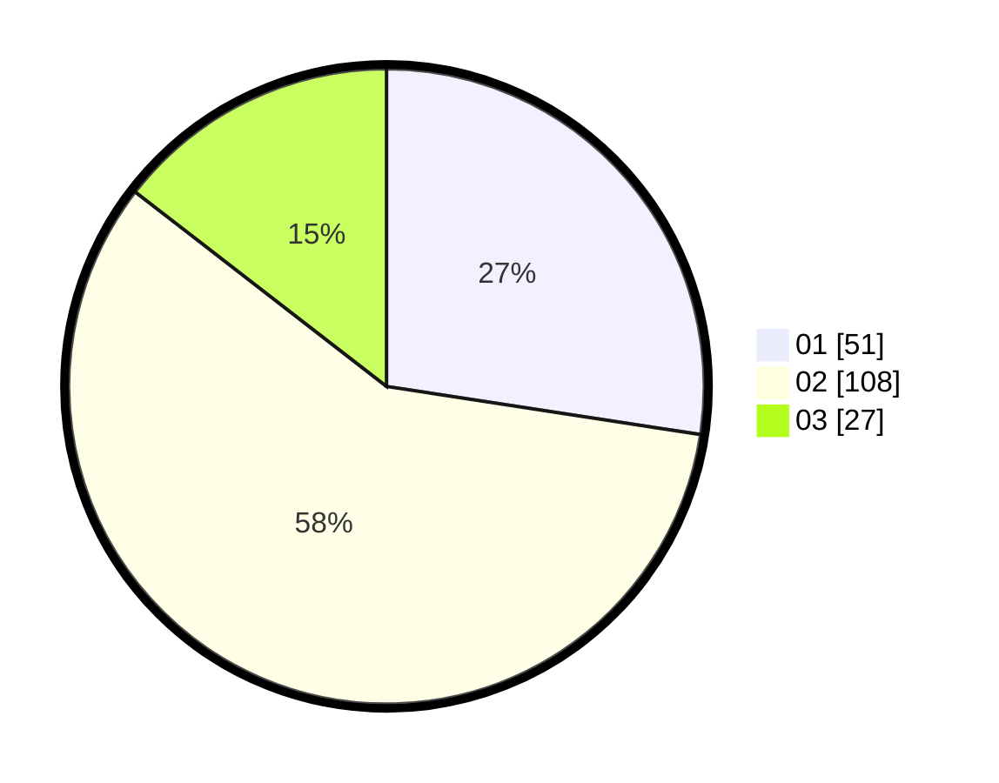

# Hasil

Hasil perolehan suara paslon dapat dilihat pada file paslon-01.txt, paslon-02.txt, dan paslon-03.txt.

Jika tidak ada, artinya data tersebut belum ada pada SIREKAP.

## Perolehan Suara

 * Paslon 01: **51**.
 * Paslon 02: **108**.
 * Paslon 03: **27**.

## Foto C Plano

https://sirekap-obj-formc.kpu.go.id/3270/pemilu/ppwp/31/72/05/10/02/3172051002106-20240214-155656--5aa293a6-ef69-4ca7-9efe-8b434b796ccf.jpg

https://sirekap-obj-formc.kpu.go.id/3270/pemilu/ppwp/31/72/05/10/02/3172051002106-20240214-155530--abeebf1f-a965-4616-87dd-a9d929cc5b80.jpg

https://sirekap-obj-formc.kpu.go.id/3270/pemilu/ppwp/31/72/05/10/02/3172051002106-20240215-000808--ce252c43-95bf-4137-b3a5-64ab27f85ff1.jpg
