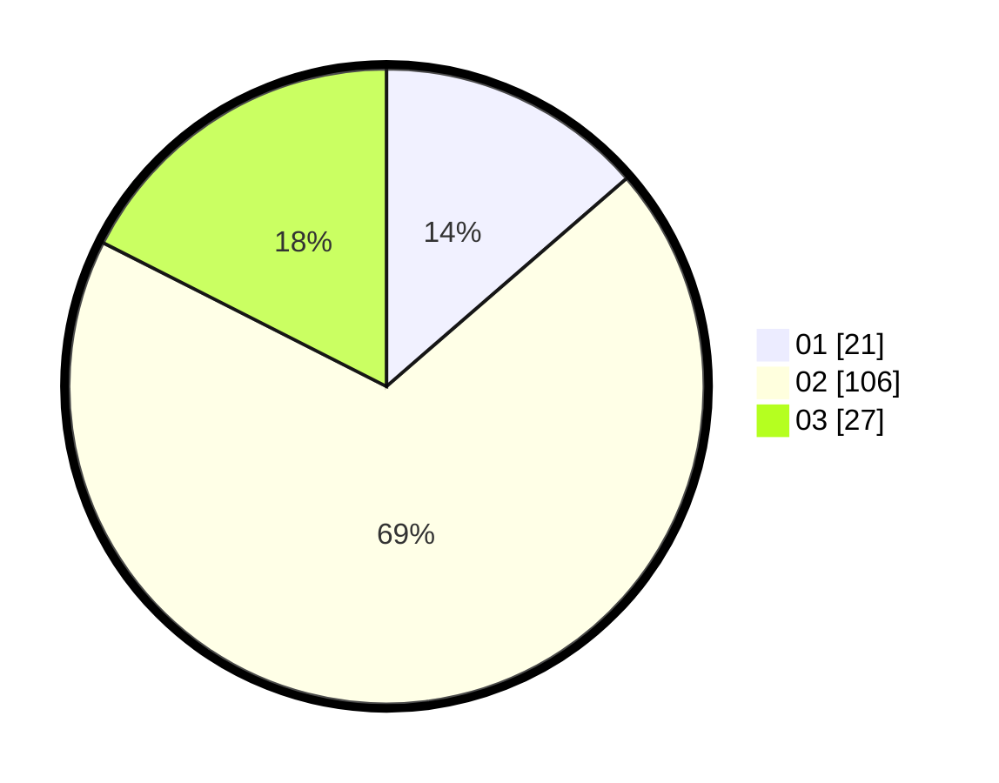

# Hasil

Hasil perolehan suara paslon dapat dilihat pada file paslon-01.txt, paslon-02.txt, dan paslon-03.txt.

Jika tidak ada, artinya data tersebut belum ada pada SIREKAP.

## Perolehan Suara

 * Paslon 01: **21**.
 * Paslon 02: **106**.
 * Paslon 03: **27**.

## Foto C Plano

https://sirekap-obj-formc.kpu.go.id/8e38/pemilu/ppwp/31/72/05/10/02/3172051002111-20240214-190804--5248e0b5-e7ba-48e9-a0db-c0225feedd25.jpg

https://sirekap-obj-formc.kpu.go.id/8e38/pemilu/ppwp/31/72/05/10/02/3172051002111-20240214-190846--bec3fa79-10f8-49db-8000-824e9e7d4e45.jpg

https://sirekap-obj-formc.kpu.go.id/8e38/pemilu/ppwp/31/72/05/10/02/3172051002111-20240214-191142--ae3caa3f-31fc-44e3-99d2-69b6072fe167.jpg

## DATA PEMILIH TETAP

Jumlah pemilih dalam DPT: **270**.
 * L: **143**.
 * P: **127**.

## DATA PENGGUNA HAK PILIH

Jumlah pengguna hak pilih dalam DPT: **207**.
 * L: **107**.
 * P: **100**.

Jumlah pengguna hak pilih dalam DPTb: **0**.
 * L: **0**.
 * P: **0**.

Jumlah pengguna hak pilih dalam DPK: **0**.
 * L: **0**.
 * P: **0**.

Jumlah pengguna hak pilih: **207**.
 * L: **107**.
 * P: **100**.

## JUMLAH SUARA SAH DAN TIDAK SAH

JUMLAH SELURUH SUARA SAH: **500**.

JUMLAH SUARA TIDAK SAH: **100**.

JUMLAH SELURUH SUARA SAH DAN SUARA TIDAK SAH: **0**.
