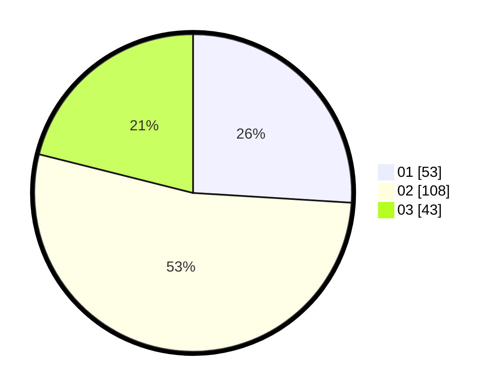

# Hasil

Hasil perolehan suara paslon dapat dilihat pada file paslon-01.txt, paslon-02.txt, dan paslon-03.txt.

Jika tidak ada, artinya data tersebut belum ada pada SIREKAP.

## Perolehan Suara

 * Paslon 01: **53**.
 * Paslon 02: **108**.
 * Paslon 03: **43**.

## Foto C Plano

https://sirekap-obj-formc.kpu.go.id/9433/pemilu/ppwp/31/72/05/10/02/3172051002113-20240214-194825--e23f65b9-1936-4d19-9250-59d47840ec58.jpg

https://sirekap-obj-formc.kpu.go.id/9433/pemilu/ppwp/31/72/05/10/02/3172051002113-20240214-194457--9647a131-9419-4a3a-9e14-2b082ae7405b.jpg

https://sirekap-obj-formc.kpu.go.id/9433/pemilu/ppwp/31/72/05/10/02/3172051002113-20240214-194712--3a9cd198-3453-45ef-9518-3ea0eaf87cb9.jpg
