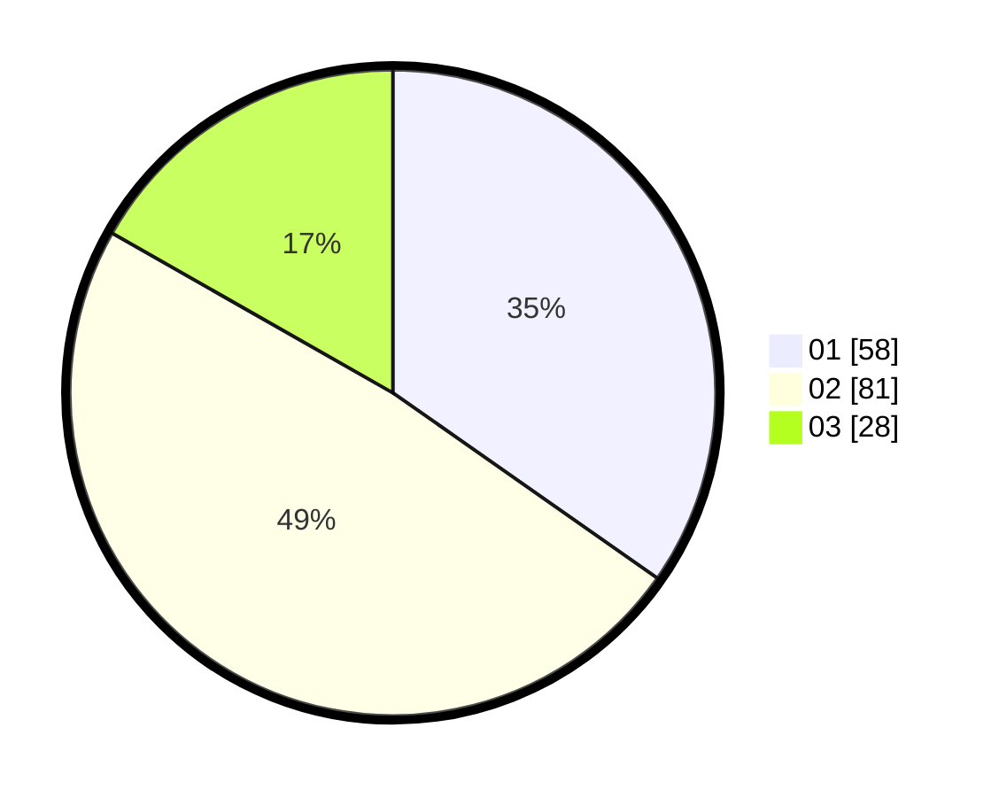

# Hasil

Hasil perolehan suara paslon dapat dilihat pada file paslon-01.txt, paslon-02.txt, dan paslon-03.txt.

Jika tidak ada, artinya data tersebut belum ada pada SIREKAP.

## Perolehan Suara

 * Paslon 01: **58**.
 * Paslon 02: **81**.
 * Paslon 03: **28**.

## Foto C Plano

https://sirekap-obj-formc.kpu.go.id/7f25/pemilu/ppwp/31/72/05/10/02/3172051002129-20240214-141805--44f7116d-a686-4a88-8d61-199d055821ab.jpg

https://sirekap-obj-formc.kpu.go.id/7f25/pemilu/ppwp/31/72/05/10/02/3172051002129-20240214-193625--d467675b-ef51-4ef4-8cec-9b4a8ab9ce37.jpg

https://sirekap-obj-formc.kpu.go.id/7f25/pemilu/ppwp/31/72/05/10/02/3172051002129-20240214-193637--01c100af-26b1-4274-b87c-52946cf0e844.jpg

## DATA PEMILIH TETAP

Jumlah pemilih dalam DPT: **273**.
 * L: **135**.
 * P: **138**.

## DATA PENGGUNA HAK PILIH

Jumlah pengguna hak pilih dalam DPT: **170**.
 * L: **78**.
 * P: **92**.

Jumlah pengguna hak pilih dalam DPTb: **0**.
 * L: **0**.
 * P: **0**.

Jumlah pengguna hak pilih dalam DPK: **0**.
 * L: **0**.
 * P: **0**.

Jumlah pengguna hak pilih: **170**.
 * L: **78**.
 * P: **92**.

## JUMLAH SUARA SAH DAN TIDAK SAH

JUMLAH SELURUH SUARA SAH: **167**.

JUMLAH SUARA TIDAK SAH: **3**.

JUMLAH SELURUH SUARA SAH DAN SUARA TIDAK SAH: **170**.
