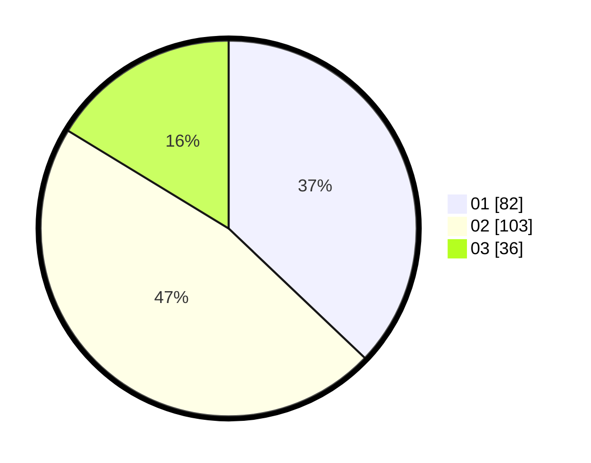

# Hasil

Hasil perolehan suara paslon dapat dilihat pada file paslon-01.txt, paslon-02.txt, dan paslon-03.txt.

Jika tidak ada, artinya data tersebut belum ada pada SIREKAP.

## Perolehan Suara

 * Paslon 01: **82**.
 * Paslon 02: **103**.
 * Paslon 03: **36**.

## Foto C Plano

https://sirekap-obj-formc.kpu.go.id/234a/pemilu/ppwp/31/72/05/10/02/3172051002134-20240215-025351--0de74586-8a52-4c03-94b2-2959ea581166.jpg

https://sirekap-obj-formc.kpu.go.id/234a/pemilu/ppwp/31/72/05/10/02/3172051002134-20240215-025522--452e4c83-7276-4ab7-b49a-6e09a584c4da.jpg

https://sirekap-obj-formc.kpu.go.id/234a/pemilu/ppwp/31/72/05/10/02/3172051002134-20240214-223154--c966650c-154d-451d-9251-0c497cff66e7.jpg
