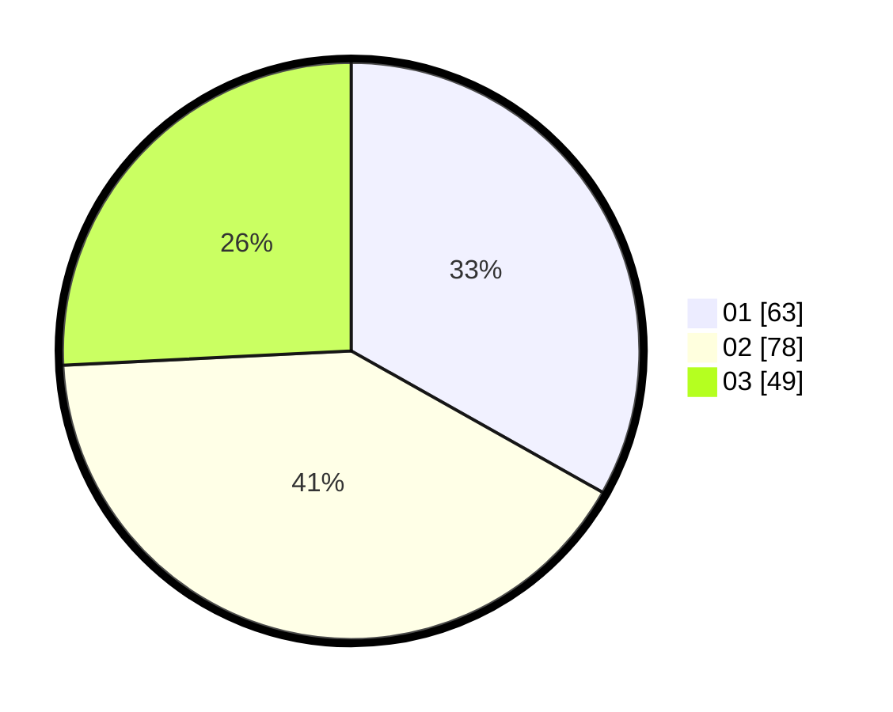

# Hasil

Hasil perolehan suara paslon dapat dilihat pada file paslon-01.txt, paslon-02.txt, dan paslon-03.txt.

Jika tidak ada, artinya data tersebut belum ada pada SIREKAP.

## Perolehan Suara

 * Paslon 01: **63**.
 * Paslon 02: **78**.
 * Paslon 03: **49**.

## Foto C Plano

https://sirekap-obj-formc.kpu.go.id/5ee9/pemilu/ppwp/31/72/05/10/02/3172051002161-20240214-190531--1dd80483-22c0-4671-9127-e6d2d0c3ed9b.jpg

https://sirekap-obj-formc.kpu.go.id/5ee9/pemilu/ppwp/31/72/05/10/02/3172051002161-20240214-192617--9bd75e18-5b9e-4306-b28c-f6460f514af6.jpg

https://sirekap-obj-formc.kpu.go.id/5ee9/pemilu/ppwp/31/72/05/10/02/3172051002161-20240214-192224--07907e71-2fb5-41a3-b497-ad3eb01c0890.jpg

## DATA PEMILIH TETAP

Jumlah pemilih dalam DPT: **263**.
 * L: **126**.
 * P: **137**.

## DATA PENGGUNA HAK PILIH

Jumlah pengguna hak pilih dalam DPT: **173**.
 * L: **79**.
 * P: **94**.

Jumlah pengguna hak pilih dalam DPTb: **13**.
 * L: **5**.
 * P: **8**.

Jumlah pengguna hak pilih dalam DPK: **4**.
 * L: **3**.
 * P: **1**.

Jumlah pengguna hak pilih: **190**.
 * L: **87**.
 * P: **103**.

## JUMLAH SUARA SAH DAN TIDAK SAH

JUMLAH SELURUH SUARA SAH: **190**.

JUMLAH SUARA TIDAK SAH: **0**.

JUMLAH SELURUH SUARA SAH DAN SUARA TIDAK SAH: **190**.
