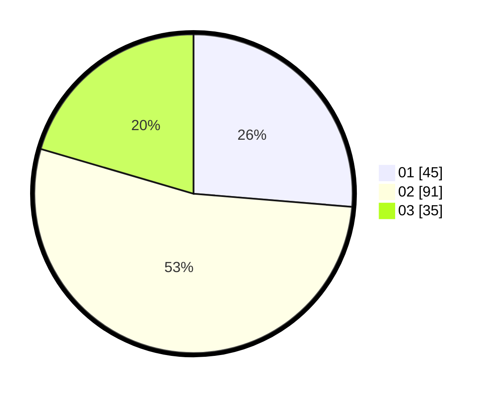

# Hasil

Hasil perolehan suara paslon dapat dilihat pada file paslon-01.txt, paslon-02.txt, dan paslon-03.txt.

Jika tidak ada, artinya data tersebut belum ada pada SIREKAP.

## Perolehan Suara

 * Paslon 01: **45**.
 * Paslon 02: **91**.
 * Paslon 03: **35**.

## Foto C Plano

https://sirekap-obj-formc.kpu.go.id/0901/pemilu/ppwp/31/72/05/10/02/3172051002163-20240214-192516--dfb81d41-8dbc-4f56-b24d-0fcfaa865420.jpg

https://sirekap-obj-formc.kpu.go.id/0901/pemilu/ppwp/31/72/05/10/02/3172051002163-20240214-193803--38ced504-435a-477a-af13-e12bc2b0a833.jpg

https://sirekap-obj-formc.kpu.go.id/0901/pemilu/ppwp/31/72/05/10/02/3172051002163-20240214-193938--3f296bbb-22dd-4dc7-ad4a-2579a0b0feef.jpg

## DATA PEMILIH TETAP

Jumlah pemilih dalam DPT: **259**.
 * L: **136**.
 * P: **123**.

## DATA PENGGUNA HAK PILIH

Jumlah pengguna hak pilih dalam DPT: **259**.
 * L: **136**.
 * P: **123**.

Jumlah pengguna hak pilih dalam DPTb: **0**.
 * L: **0**.
 * P: **0**.

Jumlah pengguna hak pilih dalam DPK: **0**.
 * L: **0**.
 * P: **0**.

Jumlah pengguna hak pilih: **259**.
 * L: **136**.
 * P: **123**.

## JUMLAH SUARA SAH DAN TIDAK SAH

JUMLAH SELURUH SUARA SAH: **171**.

JUMLAH SUARA TIDAK SAH: **2**.

JUMLAH SELURUH SUARA SAH DAN SUARA TIDAK SAH: **173**.
