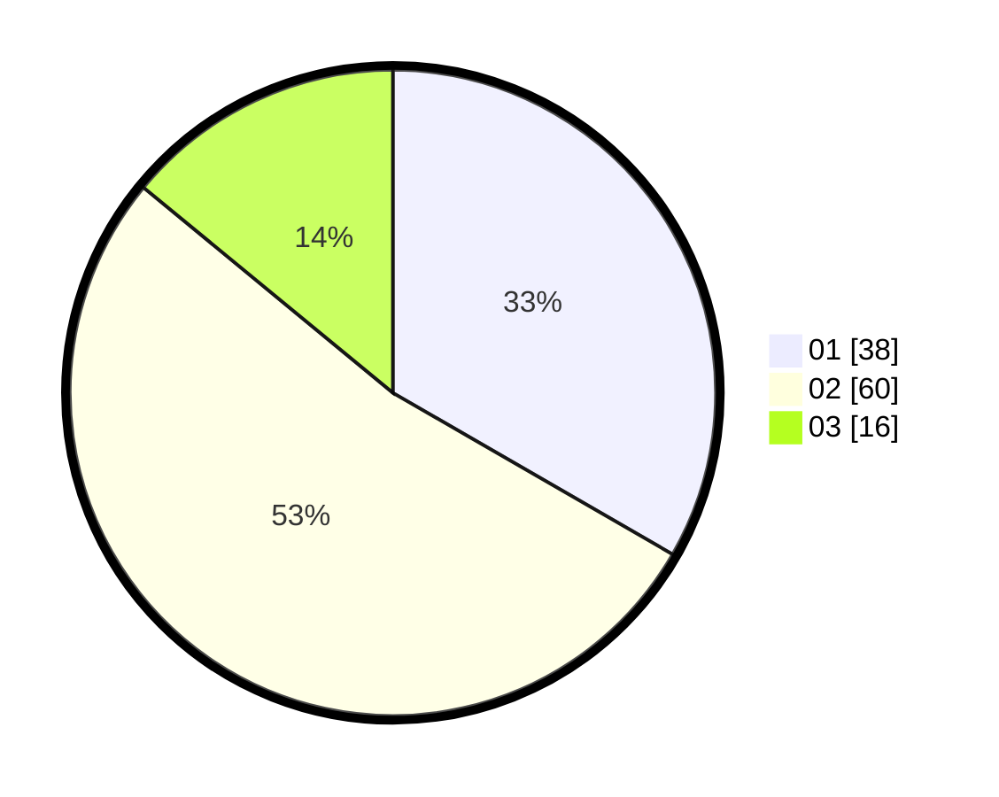

# Hasil

Hasil perolehan suara paslon dapat dilihat pada file paslon-01.txt, paslon-02.txt, dan paslon-03.txt.

Jika tidak ada, artinya data tersebut belum ada pada SIREKAP.

## Perolehan Suara

 * Paslon 01: **38**.
 * Paslon 02: **60**.
 * Paslon 03: **16**.

## Foto C Plano

https://sirekap-obj-formc.kpu.go.id/f96c/pemilu/ppwp/31/72/05/10/02/3172051002164-20240214-223421--74d4c32e-0e39-4a65-9320-a653cfab6a81.jpg

https://sirekap-obj-formc.kpu.go.id/f96c/pemilu/ppwp/31/72/05/10/02/3172051002164-20240214-223618--41b21055-0710-4ca2-9db3-9ecbcf8e4019.jpg

https://sirekap-obj-formc.kpu.go.id/f96c/pemilu/ppwp/31/72/05/10/02/3172051002164-20240214-223725--abf833df-e557-41e8-b154-ab5a3af21996.jpg

## DATA PEMILIH TETAP

Jumlah pemilih dalam DPT: **208**.
 * L: **111**.
 * P: **97**.

## DATA PENGGUNA HAK PILIH

Jumlah pengguna hak pilih dalam DPT: **117**.
 * L: **61**.
 * P: **55**.

Jumlah pengguna hak pilih dalam DPTb: **0**.
 * L: **0**.
 * P: **0**.

Jumlah pengguna hak pilih dalam DPK: **1**.
 * L: **0**.
 * P: **1**.

Jumlah pengguna hak pilih: **118**.
 * L: **61**.
 * P: **56**.

## JUMLAH SUARA SAH DAN TIDAK SAH

JUMLAH SELURUH SUARA SAH: **114**.

JUMLAH SUARA TIDAK SAH: **3**.

JUMLAH SELURUH SUARA SAH DAN SUARA TIDAK SAH: **117**.
