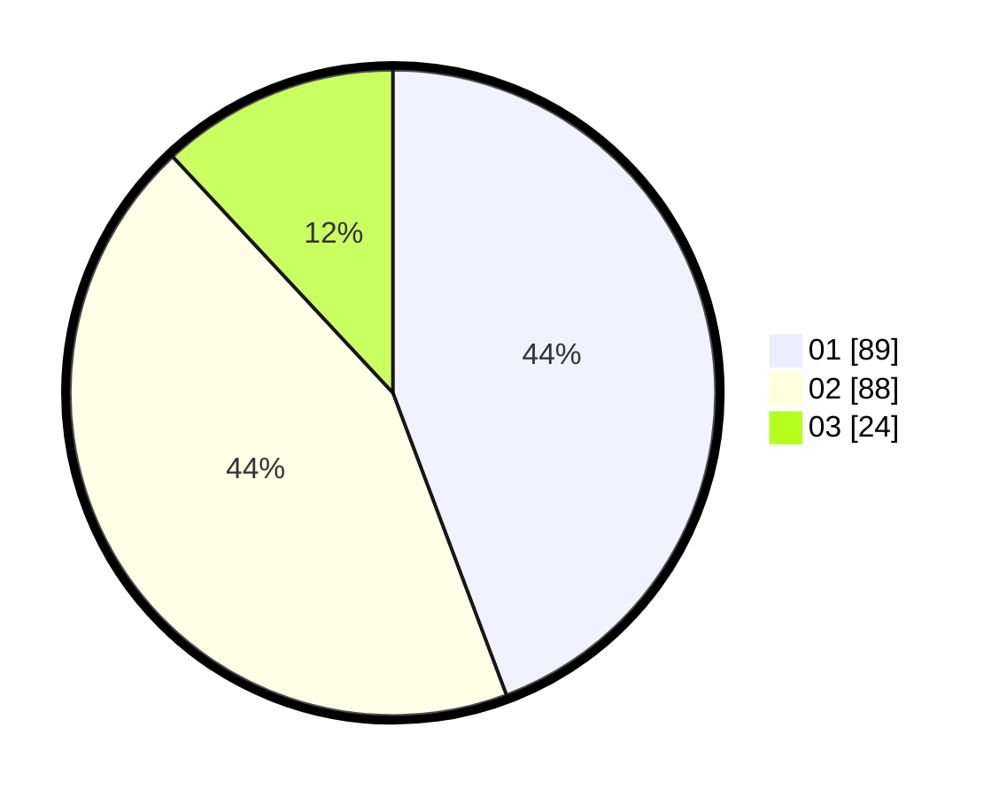

# Hasil

Hasil perolehan suara paslon dapat dilihat pada file paslon-01.txt, paslon-02.txt, dan paslon-03.txt.

Jika tidak ada, artinya data tersebut belum ada pada SIREKAP.

## Perolehan Suara

 * Paslon 01: **89**.
 * Paslon 02: **88**.
 * Paslon 03: **24**.

## Foto C Plano

https://sirekap-obj-formc.kpu.go.id/d29d/pemilu/ppwp/31/72/05/10/02/3172051002173-20240217-204101--7c41991c-6fb6-4efd-b8e5-5bde81631840.jpg

https://sirekap-obj-formc.kpu.go.id/d29d/pemilu/ppwp/31/72/05/10/02/3172051002173-20240217-204512--9bc2153a-6125-4ac1-a683-ea2d911945af.jpg

https://sirekap-obj-formc.kpu.go.id/d29d/pemilu/ppwp/31/72/05/10/02/3172051002173-20240217-203954--5cd8a7eb-630f-4430-9706-af05ef7bc15a.jpg

## DATA PEMILIH TETAP

Jumlah pemilih dalam DPT: **281**.
 * L: **134**.
 * P: **147**.

## DATA PENGGUNA HAK PILIH

Jumlah pengguna hak pilih dalam DPT: **203**.
 * L: **92**.
 * P: **111**.

Jumlah pengguna hak pilih dalam DPTb: **0**.
 * L: **0**.
 * P: **0**.

Jumlah pengguna hak pilih dalam DPK: **0**.
 * L: **0**.
 * P: **0**.

Jumlah pengguna hak pilih: **203**.
 * L: **92**.
 * P: **111**.

## JUMLAH SUARA SAH DAN TIDAK SAH

JUMLAH SELURUH SUARA SAH: **201**.

JUMLAH SUARA TIDAK SAH: **2**.

JUMLAH SELURUH SUARA SAH DAN SUARA TIDAK SAH: **203**.
