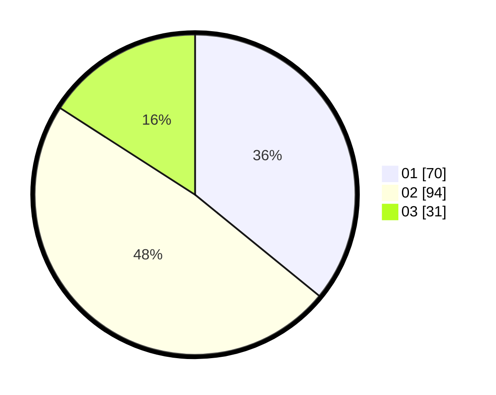

# Hasil

Hasil perolehan suara paslon dapat dilihat pada file paslon-01.txt, paslon-02.txt, dan paslon-03.txt.

Jika tidak ada, artinya data tersebut belum ada pada SIREKAP.

## Perolehan Suara

 * Paslon 01: **70**.
 * Paslon 02: **94**.
 * Paslon 03: **31**.

## Foto C Plano

https://sirekap-obj-formc.kpu.go.id/8397/pemilu/ppwp/31/72/05/10/02/3172051002175-20240216-175215--56e6490d-9a56-4805-8021-f9238d87b81a.jpg

https://sirekap-obj-formc.kpu.go.id/8397/pemilu/ppwp/31/72/05/10/02/3172051002175-20240216-181425--b7600967-9431-41e6-9631-5b16136c09d0.jpg

https://sirekap-obj-formc.kpu.go.id/8397/pemilu/ppwp/31/72/05/10/02/3172051002175-20240215-021614--9c846c05-2a8b-4d54-9724-e883368f9a6a.jpg

## DATA PEMILIH TETAP

Jumlah pemilih dalam DPT: **273**.
 * L: **141**.
 * P: **132**.

## DATA PENGGUNA HAK PILIH

Jumlah pengguna hak pilih dalam DPT: **195**.
 * L: **99**.
 * P: **96**.

Jumlah pengguna hak pilih dalam DPTb: **1**.
 * L: **0**.
 * P: **1**.

Jumlah pengguna hak pilih dalam DPK: **0**.
 * L: **0**.
 * P: **0**.

Jumlah pengguna hak pilih: **196**.
 * L: **99**.
 * P: **97**.

## JUMLAH SUARA SAH DAN TIDAK SAH

JUMLAH SELURUH SUARA SAH: **195**.

JUMLAH SUARA TIDAK SAH: **1**.

JUMLAH SELURUH SUARA SAH DAN SUARA TIDAK SAH: **196**.
