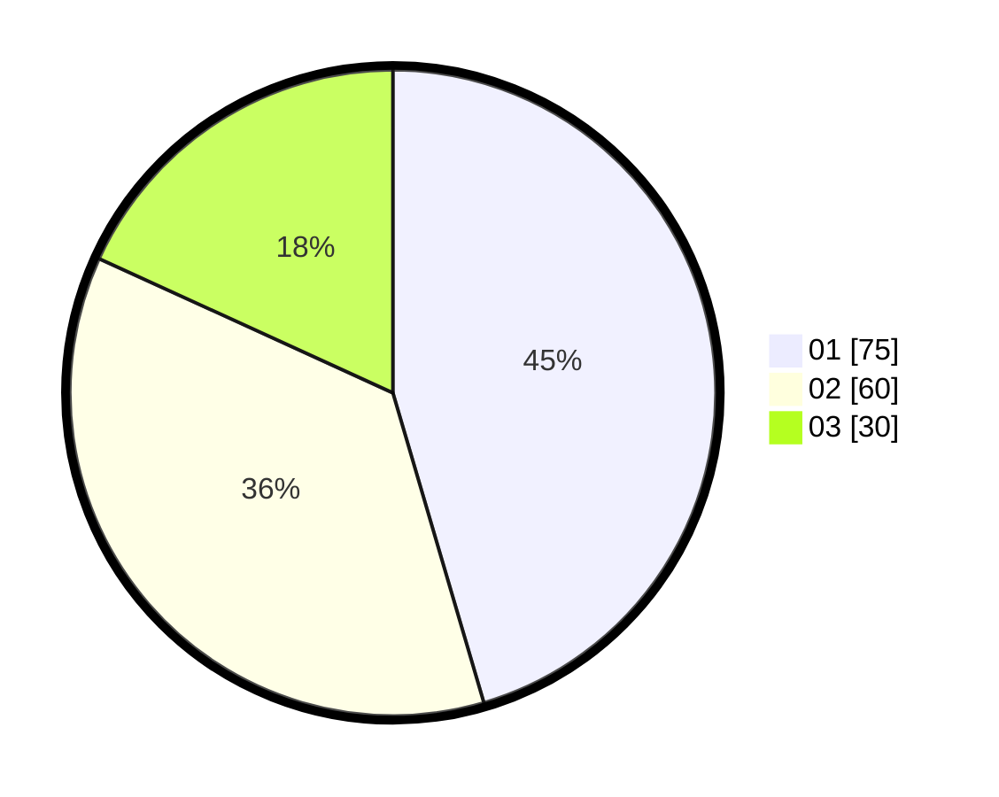

# Hasil

Hasil perolehan suara paslon dapat dilihat pada file paslon-01.txt, paslon-02.txt, dan paslon-03.txt.

Jika tidak ada, artinya data tersebut belum ada pada SIREKAP.

## Perolehan Suara

 * Paslon 01: **75**.
 * Paslon 02: **60**.
 * Paslon 03: **30**.

## Foto C Plano

https://sirekap-obj-formc.kpu.go.id/3c34/pemilu/ppwp/31/72/05/10/02/3172051002209-20240214-192745--dd47e4c0-df9a-4e22-9d27-e83c7cc2548e.jpg

https://sirekap-obj-formc.kpu.go.id/3c34/pemilu/ppwp/31/72/05/10/02/3172051002209-20240214-192829--09b6a877-db6c-4f50-83d9-708d93f5766c.jpg

https://sirekap-obj-formc.kpu.go.id/3c34/pemilu/ppwp/31/72/05/10/02/3172051002209-20240214-192936--7fd3311f-8379-4659-9b0e-d82290f19cfe.jpg

## DATA PEMILIH TETAP

Jumlah pemilih dalam DPT: **263**.
 * L: **133**.
 * P: **130**.

## DATA PENGGUNA HAK PILIH

Jumlah pengguna hak pilih dalam DPT: **165**.
 * L: **79**.
 * P: **86**.

Jumlah pengguna hak pilih dalam DPTb: **0**.
 * L: **0**.
 * P: **0**.

Jumlah pengguna hak pilih dalam DPK: **3**.
 * L: **2**.
 * P: **1**.

Jumlah pengguna hak pilih: **168**.
 * L: **81**.
 * P: **87**.

## JUMLAH SUARA SAH DAN TIDAK SAH

JUMLAH SELURUH SUARA SAH: **165**.

JUMLAH SUARA TIDAK SAH: **3**.

JUMLAH SELURUH SUARA SAH DAN SUARA TIDAK SAH: **168**.
