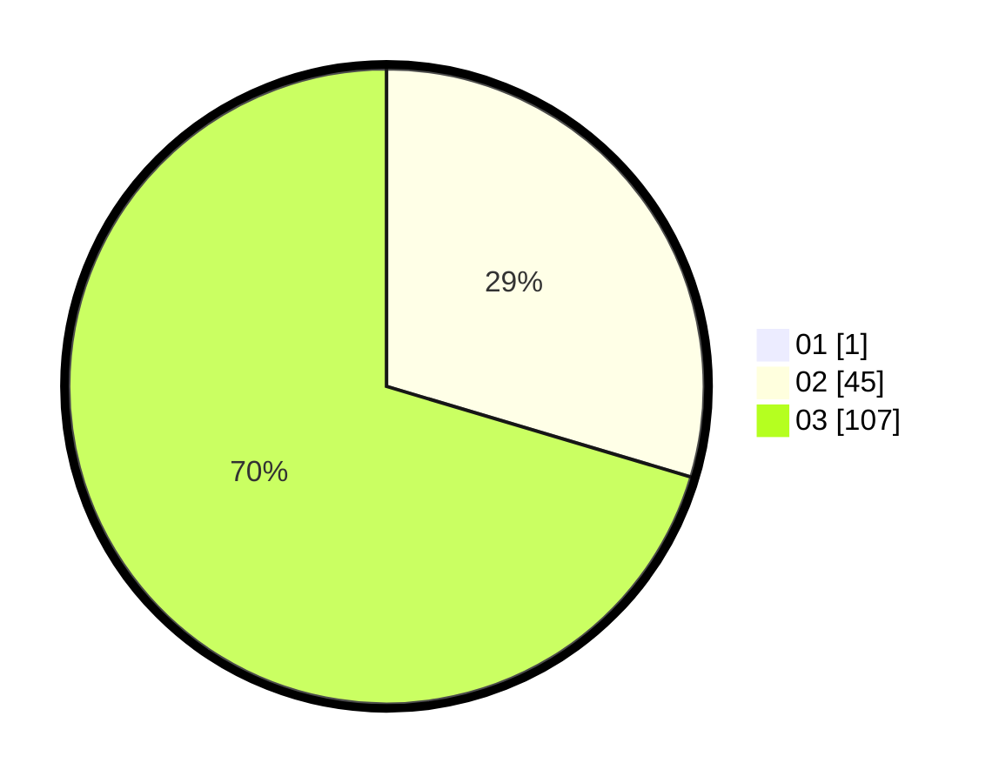

# Hasil

Hasil perolehan suara paslon dapat dilihat pada file paslon-01.txt, paslon-02.txt, dan paslon-03.txt.

Jika tidak ada, artinya data tersebut belum ada pada SIREKAP.

## Perolehan Suara

 * Paslon 01: **1**.
 * Paslon 02: **45**.
 * Paslon 03: **107**.

## Foto C Plano

https://sirekap-obj-formc.kpu.go.id/6bd3/pemilu/ppwp/31/72/05/10/02/3172051002229-20240214-220805--64e4a284-1738-4c54-acea-7f23bfcf3a58.jpg

https://sirekap-obj-formc.kpu.go.id/6bd3/pemilu/ppwp/31/72/05/10/02/3172051002229-20240214-220912--5ff9cb51-6d50-4a0a-a650-c22943aab745.jpg

https://sirekap-obj-formc.kpu.go.id/6bd3/pemilu/ppwp/31/72/05/10/02/3172051002229-20240214-221020--c665d552-728c-49fe-84f2-281d05f8e7fb.jpg
