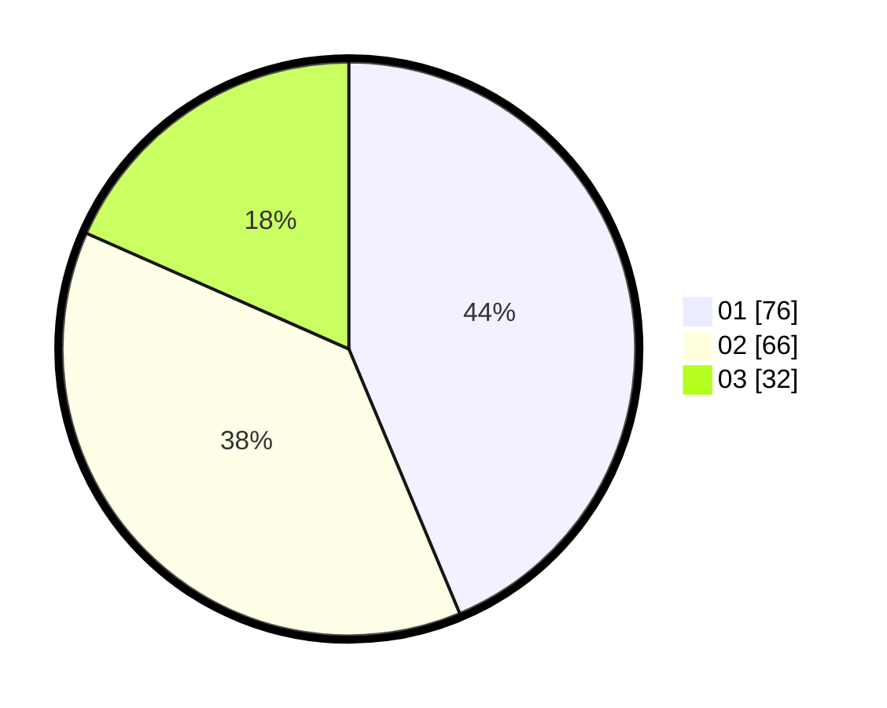

# Hasil

Hasil perolehan suara paslon dapat dilihat pada file paslon-01.txt, paslon-02.txt, dan paslon-03.txt.

Jika tidak ada, artinya data tersebut belum ada pada SIREKAP.

## Perolehan Suara

 * Paslon 01: **76**.
 * Paslon 02: **66**.
 * Paslon 03: **32**.

## Foto C Plano

https://sirekap-obj-formc.kpu.go.id/aa26/pemilu/ppwp/31/72/05/10/02/3172051002249-20240214-231008--a20fc447-0de4-418c-88cd-e4be51df6f30.jpg

https://sirekap-obj-formc.kpu.go.id/aa26/pemilu/ppwp/31/72/05/10/02/3172051002249-20240214-193412--cbcccf54-009a-488f-b047-33aec613d368.jpg

https://sirekap-obj-formc.kpu.go.id/aa26/pemilu/ppwp/31/72/05/10/02/3172051002249-20240214-231243--d04978a5-0a6b-47f2-90b8-1775ae03ab7a.jpg
