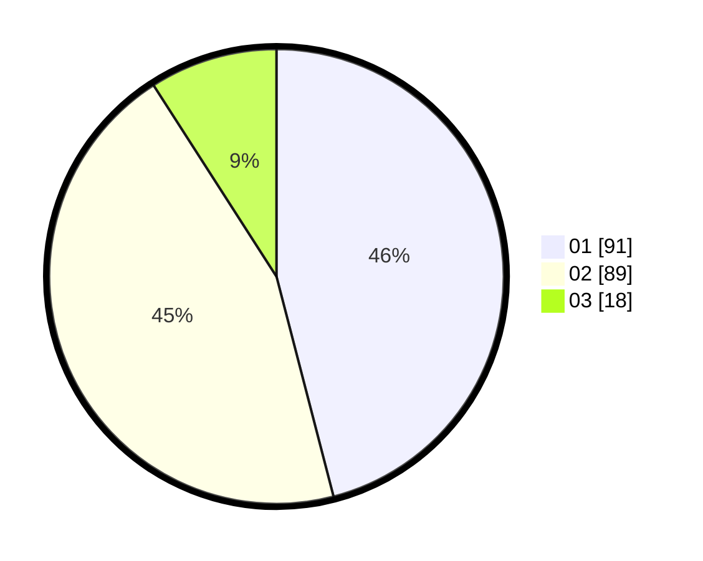

# Hasil

Hasil perolehan suara paslon dapat dilihat pada file paslon-01.txt, paslon-02.txt, dan paslon-03.txt.

Jika tidak ada, artinya data tersebut belum ada pada SIREKAP.

## Perolehan Suara

 * Paslon 01: **91**.
 * Paslon 02: **89**.
 * Paslon 03: **18**.

## Foto C Plano

https://sirekap-obj-formc.kpu.go.id/7cd0/pemilu/ppwp/31/72/05/10/03/3172051003022-20240215-112430--cd6b88bf-73ab-43bf-8148-b2780d365202.jpg

https://sirekap-obj-formc.kpu.go.id/7cd0/pemilu/ppwp/31/72/05/10/03/3172051003022-20240214-234732--3696d44e-63d9-49d7-a1e2-3e199ce4f608.jpg

https://sirekap-obj-formc.kpu.go.id/7cd0/pemilu/ppwp/31/72/05/10/03/3172051003022-20240214-235019--6609ac6a-ca47-40a0-9511-544fa7e9b8d3.jpg
