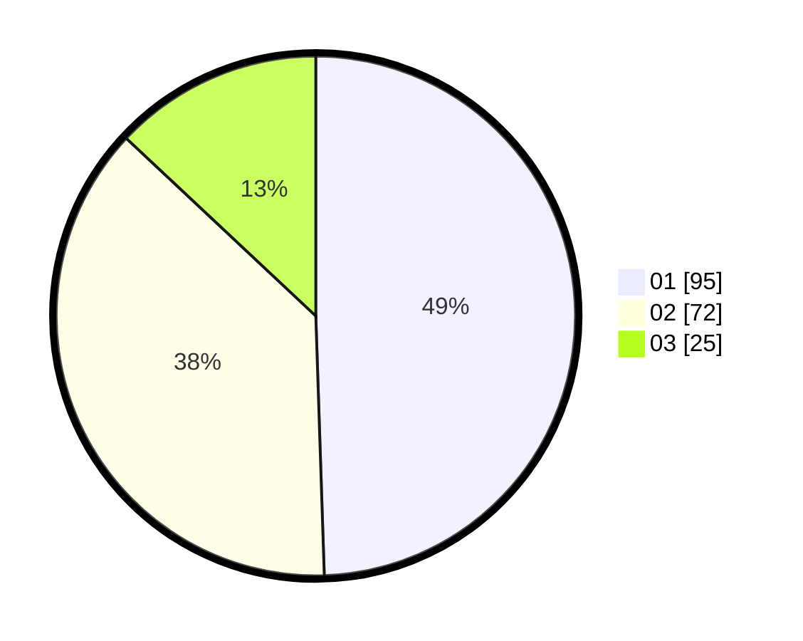

# Hasil

Hasil perolehan suara paslon dapat dilihat pada file paslon-01.txt, paslon-02.txt, dan paslon-03.txt.

Jika tidak ada, artinya data tersebut belum ada pada SIREKAP.

## Perolehan Suara

 * Paslon 01: **95**.
 * Paslon 02: **72**.
 * Paslon 03: **25**.

## Foto C Plano

https://sirekap-obj-formc.kpu.go.id/345a/pemilu/ppwp/31/72/05/10/03/3172051003034-20240215-005101--abf66807-d500-4ba4-b3af-393d12a31590.jpg

https://sirekap-obj-formc.kpu.go.id/345a/pemilu/ppwp/31/72/05/10/03/3172051003034-20240215-005302--a8e3f384-4ecc-49dc-9d65-80a17c8b63fd.jpg

https://sirekap-obj-formc.kpu.go.id/345a/pemilu/ppwp/31/72/05/10/03/3172051003034-20240215-005353--f893ae22-1db4-4110-b39b-aee815ed46f7.jpg

## DATA PEMILIH TETAP

Jumlah pemilih dalam DPT: **276**.
 * L: **147**.
 * P: **129**.

## DATA PENGGUNA HAK PILIH

Jumlah pengguna hak pilih dalam DPT: **187**.
 * L: **101**.
 * P: **86**.

Jumlah pengguna hak pilih dalam DPTb: **5**.
 * L: **4**.
 * P: **1**.

Jumlah pengguna hak pilih dalam DPK: **2**.
 * L: **0**.
 * P: **2**.

Jumlah pengguna hak pilih: **194**.
 * L: **105**.
 * P: **89**.

## JUMLAH SUARA SAH DAN TIDAK SAH

JUMLAH SELURUH SUARA SAH: **192**.

JUMLAH SUARA TIDAK SAH: **2**.

JUMLAH SELURUH SUARA SAH DAN SUARA TIDAK SAH: **194**.
