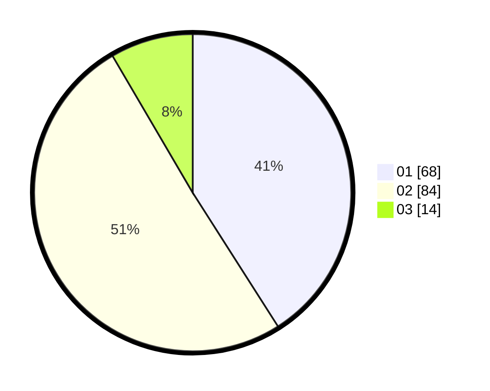

# Hasil

Hasil perolehan suara paslon dapat dilihat pada file paslon-01.txt, paslon-02.txt, dan paslon-03.txt.

Jika tidak ada, artinya data tersebut belum ada pada SIREKAP.

## Perolehan Suara

 * Paslon 01: **68**.
 * Paslon 02: **84**.
 * Paslon 03: **14**.

## Foto C Plano

https://sirekap-obj-formc.kpu.go.id/ba51/pemilu/ppwp/31/72/06/10/01/3172061001015-20240214-194753--0584cbbb-24fe-430d-bea4-9d8d07a96a83.jpg

https://sirekap-obj-formc.kpu.go.id/ba51/pemilu/ppwp/31/72/06/10/01/3172061001015-20240214-194846--3216173d-c9a5-418b-abb4-3c9f284c4bbf.jpg

https://sirekap-obj-formc.kpu.go.id/ba51/pemilu/ppwp/31/72/06/10/01/3172061001015-20240214-194905--e2162d6e-f28d-4163-ac43-583d9996f9c3.jpg

## DATA PEMILIH TETAP

Jumlah pemilih dalam DPT: **224**.
 * L: **109**.
 * P: **115**.

## DATA PENGGUNA HAK PILIH

Jumlah pengguna hak pilih dalam DPT: **173**.
 * L: **83**.
 * P: **90**.

Jumlah pengguna hak pilih dalam DPTb: **1**.
 * L: **0**.
 * P: **1**.

Jumlah pengguna hak pilih dalam DPK: **0**.
 * L: **0**.
 * P: **0**.

Jumlah pengguna hak pilih: **174**.
 * L: **83**.
 * P: **91**.

## JUMLAH SUARA SAH DAN TIDAK SAH

JUMLAH SELURUH SUARA SAH: **166**.

JUMLAH SUARA TIDAK SAH: **8**.

JUMLAH SELURUH SUARA SAH DAN SUARA TIDAK SAH: **174**.
