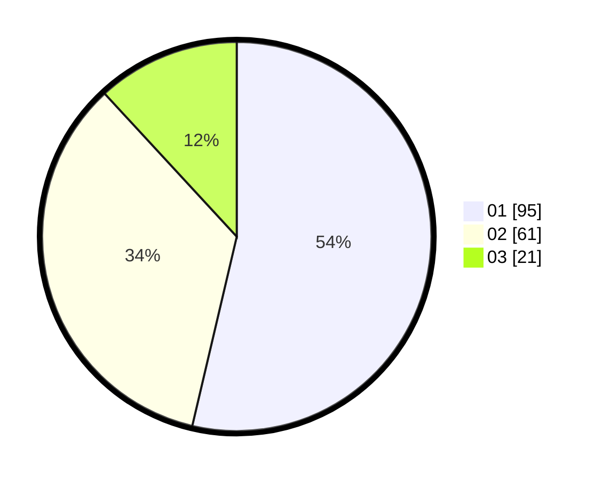

# Hasil

Hasil perolehan suara paslon dapat dilihat pada file paslon-01.txt, paslon-02.txt, dan paslon-03.txt.

Jika tidak ada, artinya data tersebut belum ada pada SIREKAP.

## Perolehan Suara

 * Paslon 01: **95**.
 * Paslon 02: **61**.
 * Paslon 03: **21**.

## Foto C Plano

https://sirekap-obj-formc.kpu.go.id/0933/pemilu/ppwp/31/72/06/10/01/3172061001028-20240216-154846--5d761bec-19eb-40d7-a4a0-6c6d518e2759.jpg

https://sirekap-obj-formc.kpu.go.id/0933/pemilu/ppwp/31/72/06/10/01/3172061001028-20240216-154848--424cbd17-4d93-4700-924b-37a0a03fc498.jpg

https://sirekap-obj-formc.kpu.go.id/0933/pemilu/ppwp/31/72/06/10/01/3172061001028-20240216-154847--5a050c0c-e37b-4d7d-b81e-576b29e59158.jpg

## DATA PEMILIH TETAP

Jumlah pemilih dalam DPT: **215**.
 * L: **100**.
 * P: **115**.

## DATA PENGGUNA HAK PILIH

Jumlah pengguna hak pilih dalam DPT: **174**.
 * L: **81**.
 * P: **93**.

Jumlah pengguna hak pilih dalam DPTb: **1**.
 * L: **1**.
 * P: **0**.

Jumlah pengguna hak pilih dalam DPK: **2**.
 * L: **1**.
 * P: **1**.

Jumlah pengguna hak pilih: **177**.
 * L: **83**.
 * P: **94**.

## JUMLAH SUARA SAH DAN TIDAK SAH

JUMLAH SELURUH SUARA SAH: **177**.

JUMLAH SUARA TIDAK SAH: **0**.

JUMLAH SELURUH SUARA SAH DAN SUARA TIDAK SAH: **177**.
