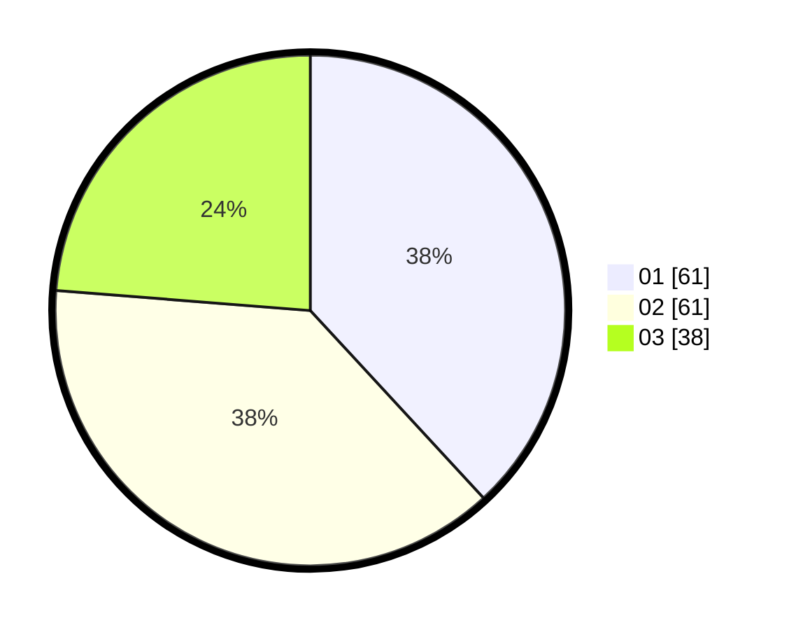

# Hasil

Hasil perolehan suara paslon dapat dilihat pada file paslon-01.txt, paslon-02.txt, dan paslon-03.txt.

Jika tidak ada, artinya data tersebut belum ada pada SIREKAP.

## Perolehan Suara

 * Paslon 01: **61**.
 * Paslon 02: **61**.
 * Paslon 03: **38**.

## Foto C Plano

https://sirekap-obj-formc.kpu.go.id/d876/pemilu/ppwp/31/72/06/10/01/3172061001031-20240214-204754--dd269a8d-518e-4d5f-bec8-7828a961ea75.jpg

https://sirekap-obj-formc.kpu.go.id/d876/pemilu/ppwp/31/72/06/10/01/3172061001031-20240214-204806--91d541e0-720f-40d9-acc8-607049487a68.jpg

https://sirekap-obj-formc.kpu.go.id/d876/pemilu/ppwp/31/72/06/10/01/3172061001031-20240214-204810--e30dc761-2f79-4972-82ab-ea365f6988b4.jpg

## DATA PEMILIH TETAP

Jumlah pemilih dalam DPT: **214**.
 * L: **94**.
 * P: **120**.

## DATA PENGGUNA HAK PILIH

Jumlah pengguna hak pilih dalam DPT: **156**.
 * L: **73**.
 * P: **83**.

Jumlah pengguna hak pilih dalam DPTb: **4**.
 * L: **1**.
 * P: **3**.

Jumlah pengguna hak pilih dalam DPK: **1**.
 * L: **1**.
 * P: **0**.

Jumlah pengguna hak pilih: **161**.
 * L: **75**.
 * P: **86**.

## JUMLAH SUARA SAH DAN TIDAK SAH

JUMLAH SELURUH SUARA SAH: **160**.

JUMLAH SUARA TIDAK SAH: **1**.

JUMLAH SELURUH SUARA SAH DAN SUARA TIDAK SAH: **161**.
