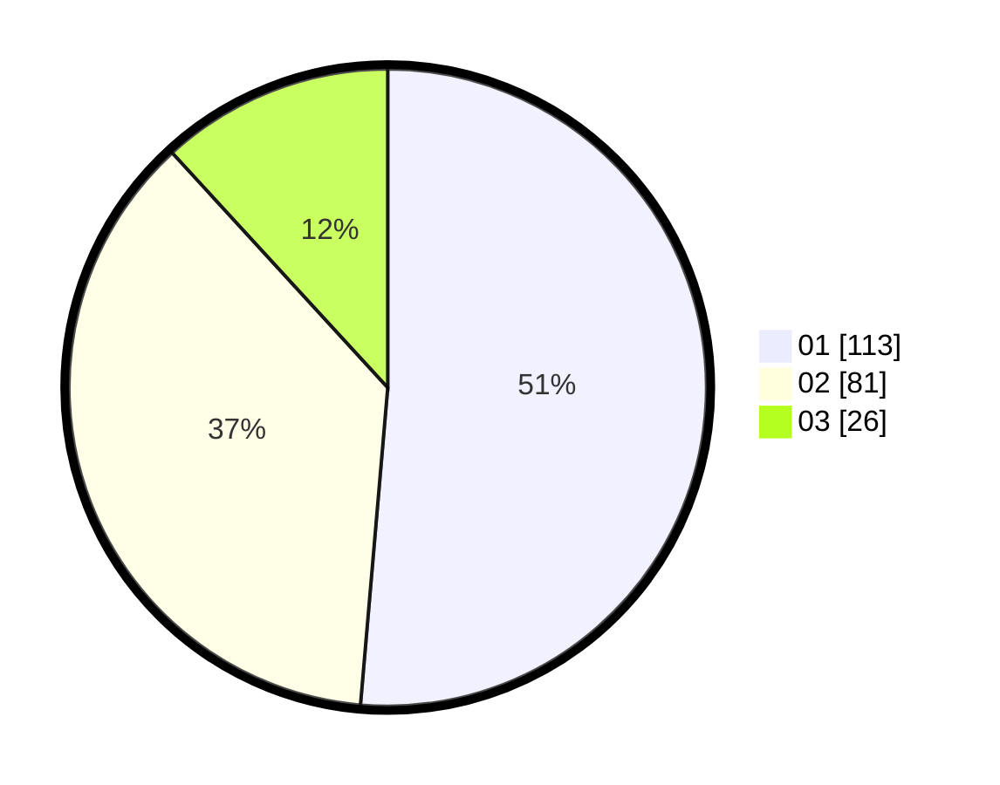

# Hasil

Hasil perolehan suara paslon dapat dilihat pada file paslon-01.txt, paslon-02.txt, dan paslon-03.txt.

Jika tidak ada, artinya data tersebut belum ada pada SIREKAP.

## Perolehan Suara

 * Paslon 01: **113**.
 * Paslon 02: **81**.
 * Paslon 03: **26**.

## Foto C Plano

https://sirekap-obj-formc.kpu.go.id/f4dc/pemilu/ppwp/31/72/06/10/01/3172061001032-20240216-174313--4253bd83-b401-4f78-9a2d-a36d47325f78.jpg

https://sirekap-obj-formc.kpu.go.id/f4dc/pemilu/ppwp/31/72/06/10/01/3172061001032-20240216-170930--31829b92-0afa-48b5-81a8-e87833a5e41a.jpg

https://sirekap-obj-formc.kpu.go.id/f4dc/pemilu/ppwp/31/72/06/10/01/3172061001032-20240216-162739--8464a0b2-f260-45e3-8103-fa6afcc0b1d3.jpg

## DATA PEMILIH TETAP

Jumlah pemilih dalam DPT: **286**.
 * L: **143**.
 * P: **143**.

## DATA PENGGUNA HAK PILIH

Jumlah pengguna hak pilih dalam DPT: **220**.
 * L: **107**.
 * P: **113**.

Jumlah pengguna hak pilih dalam DPTb: **3**.
 * L: **2**.
 * P: **1**.

Jumlah pengguna hak pilih dalam DPK: **0**.
 * L: **0**.
 * P: **0**.

Jumlah pengguna hak pilih: **223**.
 * L: **109**.
 * P: **114**.

## JUMLAH SUARA SAH DAN TIDAK SAH

JUMLAH SELURUH SUARA SAH: **220**.

JUMLAH SUARA TIDAK SAH: **3**.

JUMLAH SELURUH SUARA SAH DAN SUARA TIDAK SAH: **223**.
