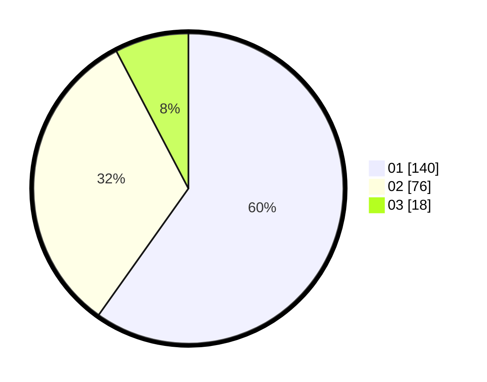

# Hasil

Hasil perolehan suara paslon dapat dilihat pada file paslon-01.txt, paslon-02.txt, dan paslon-03.txt.

Jika tidak ada, artinya data tersebut belum ada pada SIREKAP.

## Perolehan Suara

 * Paslon 01: **140**.
 * Paslon 02: **76**.
 * Paslon 03: **18**.

## Foto C Plano

https://sirekap-obj-formc.kpu.go.id/f3fe/pemilu/ppwp/31/72/06/10/01/3172061001033-20240214-225941--0c56fb73-aaab-4300-9da4-56bbe3a7c595.jpg

https://sirekap-obj-formc.kpu.go.id/f3fe/pemilu/ppwp/31/72/06/10/01/3172061001033-20240214-230038--e801f451-d096-439d-991f-d967f604a784.jpg

https://sirekap-obj-formc.kpu.go.id/f3fe/pemilu/ppwp/31/72/06/10/01/3172061001033-20240214-230123--b46b94c9-a2af-47bc-b975-318100370901.jpg
