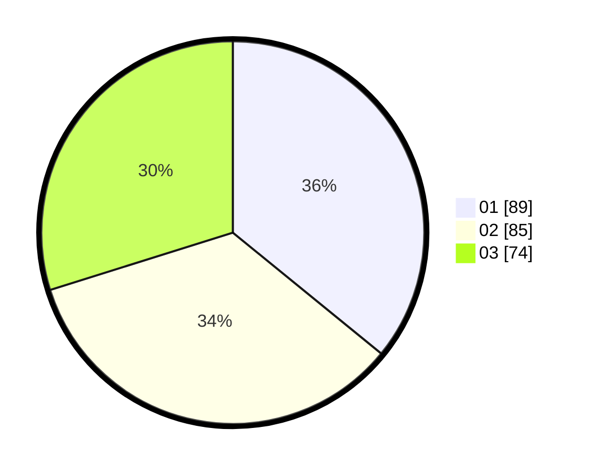

# Hasil

Hasil perolehan suara paslon dapat dilihat pada file paslon-01.txt, paslon-02.txt, dan paslon-03.txt.

Jika tidak ada, artinya data tersebut belum ada pada SIREKAP.

## Perolehan Suara

 * Paslon 01: **89**.
 * Paslon 02: **85**.
 * Paslon 03: **74**.

## Foto C Plano

https://sirekap-obj-formc.kpu.go.id/1548/pemilu/ppwp/31/72/06/10/01/3172061001066-20240214-212156--9dd289c7-8b9c-45e8-a5d6-81ba290c78eb.jpg

https://sirekap-obj-formc.kpu.go.id/1548/pemilu/ppwp/31/72/06/10/01/3172061001066-20240214-212419--e38e729d-ad88-48c5-a280-c4cc2403e023.jpg

https://sirekap-obj-formc.kpu.go.id/1548/pemilu/ppwp/31/72/06/10/01/3172061001066-20240214-212620--6d99b775-2b00-456b-9846-11a59129b596.jpg

## DATA PEMILIH TETAP

Jumlah pemilih dalam DPT: **293**.
 * L: **130**.
 * P: **363**.

## DATA PENGGUNA HAK PILIH

Jumlah pengguna hak pilih dalam DPT: **238**.
 * L: **108**.
 * P: **130**.

Jumlah pengguna hak pilih dalam DPTb: **11**.
 * L: **3**.
 * P: **8**.

Jumlah pengguna hak pilih dalam DPK: **3**.
 * L: **2**.
 * P: **1**.

Jumlah pengguna hak pilih: **252**.
 * L: **113**.
 * P: **139**.

## JUMLAH SUARA SAH DAN TIDAK SAH

JUMLAH SELURUH SUARA SAH: **248**.

JUMLAH SUARA TIDAK SAH: **4**.

JUMLAH SELURUH SUARA SAH DAN SUARA TIDAK SAH: **252**.
