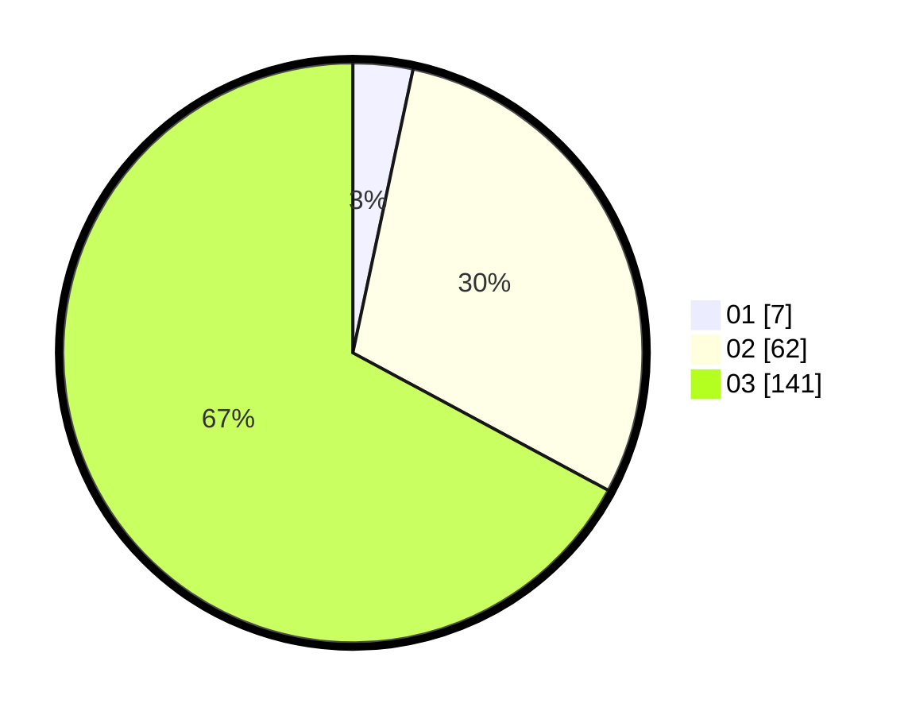

# Hasil

Hasil perolehan suara paslon dapat dilihat pada file paslon-01.txt, paslon-02.txt, dan paslon-03.txt.

Jika tidak ada, artinya data tersebut belum ada pada SIREKAP.

## Perolehan Suara

 * Paslon 01: **7**.
 * Paslon 02: **62**.
 * Paslon 03: **141**.

## Foto C Plano

https://sirekap-obj-formc.kpu.go.id/c007/pemilu/ppwp/31/72/06/10/01/3172061001092-20240214-155739--affea40c-5f9d-4497-8d9a-5649b0c4aaeb.jpg

https://sirekap-obj-formc.kpu.go.id/c007/pemilu/ppwp/31/72/06/10/01/3172061001092-20240214-162210--625df340-db32-484f-9d06-754565629ed1.jpg

https://sirekap-obj-formc.kpu.go.id/c007/pemilu/ppwp/31/72/06/10/01/3172061001092-20240214-155807--695b451c-1177-434c-9571-be5cb32faf85.jpg
