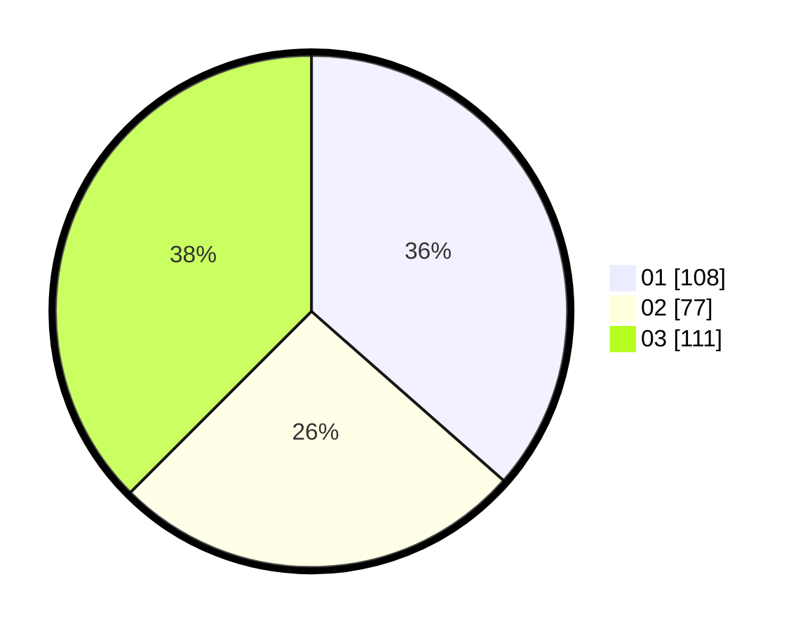

# Hasil

Hasil perolehan suara paslon dapat dilihat pada file paslon-01.txt, paslon-02.txt, dan paslon-03.txt.

Jika tidak ada, artinya data tersebut belum ada pada SIREKAP.

## Perolehan Suara

 * Paslon 01: **108**.
 * Paslon 02: **77**.
 * Paslon 03: **111**.

## Foto C Plano

https://sirekap-obj-formc.kpu.go.id/191d/pemilu/ppwp/31/72/06/10/01/3172061001118-20240214-200202--84090a7d-5619-4859-a25b-e3fa9cb3cf1d.jpg

https://sirekap-obj-formc.kpu.go.id/191d/pemilu/ppwp/31/72/06/10/01/3172061001118-20240214-200257--00f9ed56-09b3-4a20-8592-dbcc8953de8d.jpg

https://sirekap-obj-formc.kpu.go.id/191d/pemilu/ppwp/31/72/06/10/01/3172061001118-20240214-200344--802afc79-c9d3-4f66-b228-868bca528348.jpg

## DATA PEMILIH TETAP

Jumlah pemilih dalam DPT: **249**.
 * L: **123**.
 * P: **126**.

## DATA PENGGUNA HAK PILIH

Jumlah pengguna hak pilih dalam DPT: **189**.
 * L: **93**.
 * P: **96**.

Jumlah pengguna hak pilih dalam DPTb: **4**.
 * L: **1**.
 * P: **3**.

Jumlah pengguna hak pilih dalam DPK: **4**.
 * L: **1**.
 * P: **3**.

Jumlah pengguna hak pilih: **197**.
 * L: **95**.
 * P: **102**.

## JUMLAH SUARA SAH DAN TIDAK SAH

JUMLAH SELURUH SUARA SAH: **196**.

JUMLAH SUARA TIDAK SAH: **1**.

JUMLAH SELURUH SUARA SAH DAN SUARA TIDAK SAH: **197**.
