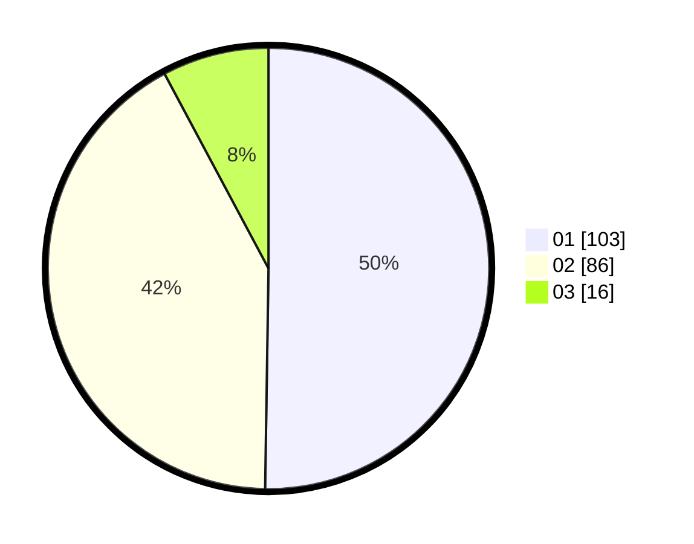

# Hasil

Hasil perolehan suara paslon dapat dilihat pada file paslon-01.txt, paslon-02.txt, dan paslon-03.txt.

Jika tidak ada, artinya data tersebut belum ada pada SIREKAP.

## Perolehan Suara

 * Paslon 01: **103**.
 * Paslon 02: **86**.
 * Paslon 03: **16**.

## Foto C Plano

https://sirekap-obj-formc.kpu.go.id/8571/pemilu/ppwp/31/72/06/10/02/3172061002006-20240216-172354--8b8e3100-079e-457c-9774-6660bc0c85b8.jpg

https://sirekap-obj-formc.kpu.go.id/8571/pemilu/ppwp/31/72/06/10/02/3172061002006-20240216-172514--73b25e3c-26d0-42de-b947-1bcb49ce51a2.jpg

https://sirekap-obj-formc.kpu.go.id/8571/pemilu/ppwp/31/72/06/10/02/3172061002006-20240216-172551--1dd2f10a-6afb-4ece-b73c-e3ac21d5aba6.jpg
