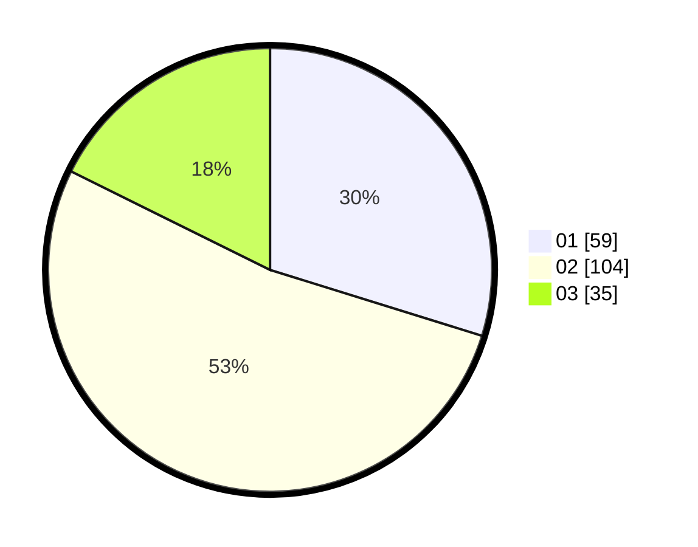

# Hasil

Hasil perolehan suara paslon dapat dilihat pada file paslon-01.txt, paslon-02.txt, dan paslon-03.txt.

Jika tidak ada, artinya data tersebut belum ada pada SIREKAP.

## Perolehan Suara

 * Paslon 01: **59**.
 * Paslon 02: **104**.
 * Paslon 03: **35**.

## Foto C Plano

https://sirekap-obj-formc.kpu.go.id/9794/pemilu/ppwp/31/72/06/10/02/3172061002020-20240214-212224--939bd954-1d9d-4782-9a20-a553c49a1c5e.jpg

https://sirekap-obj-formc.kpu.go.id/9794/pemilu/ppwp/31/72/06/10/02/3172061002020-20240214-235642--323d1690-51d6-4f12-9dff-439296b47729.jpg

https://sirekap-obj-formc.kpu.go.id/9794/pemilu/ppwp/31/72/06/10/02/3172061002020-20240214-212354--1b83a87b-4040-42f7-bfe3-92041f115548.jpg

## DATA PEMILIH TETAP

Jumlah pemilih dalam DPT: **290**.
 * L: **155**.
 * P: **135**.

## DATA PENGGUNA HAK PILIH

Jumlah pengguna hak pilih dalam DPT: **198**.
 * L: **98**.
 * P: **100**.

Jumlah pengguna hak pilih dalam DPTb: **3**.
 * L: **1**.
 * P: **2**.

Jumlah pengguna hak pilih dalam DPK: **1**.
 * L: **0**.
 * P: **1**.

Jumlah pengguna hak pilih: **202**.
 * L: **99**.
 * P: **103**.

## JUMLAH SUARA SAH DAN TIDAK SAH

JUMLAH SELURUH SUARA SAH: **198**.

JUMLAH SUARA TIDAK SAH: **4**.

JUMLAH SELURUH SUARA SAH DAN SUARA TIDAK SAH: **202**.
