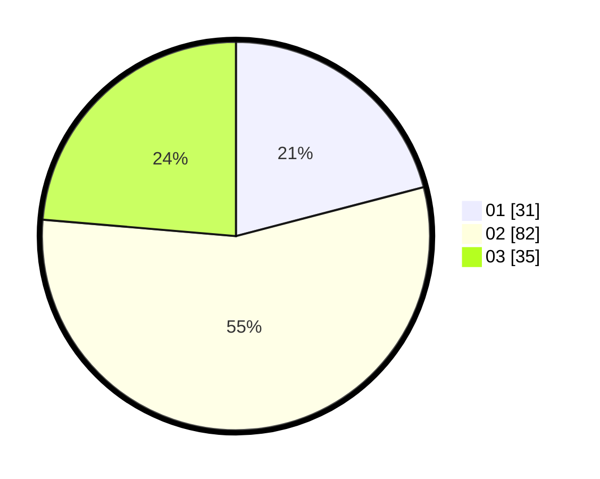

# Hasil

Hasil perolehan suara paslon dapat dilihat pada file paslon-01.txt, paslon-02.txt, dan paslon-03.txt.

Jika tidak ada, artinya data tersebut belum ada pada SIREKAP.

## Perolehan Suara

 * Paslon 01: **31**.
 * Paslon 02: **82**.
 * Paslon 03: **35**.

## Foto C Plano

https://sirekap-obj-formc.kpu.go.id/b42a/pemilu/ppwp/31/72/06/10/02/3172061002028-20240214-185659--513c3d0c-63f0-46bf-9a2c-51e3185957a4.jpg

https://sirekap-obj-formc.kpu.go.id/b42a/pemilu/ppwp/31/72/06/10/02/3172061002028-20240214-185719--89ef8ef5-8f0f-4f54-8a41-4c21fa1cb040.jpg

https://sirekap-obj-formc.kpu.go.id/b42a/pemilu/ppwp/31/72/06/10/02/3172061002028-20240214-190806--a299e0e4-7513-4ea2-980d-1a189f25e648.jpg

## DATA PEMILIH TETAP

Jumlah pemilih dalam DPT: **110**.
 * L: **55**.
 * P: **55**.

## DATA PENGGUNA HAK PILIH

Jumlah pengguna hak pilih dalam DPT: **285**.
 * L: **135**.
 * P: **150**.

Jumlah pengguna hak pilih dalam DPTb: **8**.
 * L: **4**.
 * P: **4**.

Jumlah pengguna hak pilih dalam DPK: **31**.
 * L: **7**.
 * P: **14**.

Jumlah pengguna hak pilih: **324**.
 * L: **156**.
 * P: **168**.

## JUMLAH SUARA SAH DAN TIDAK SAH

JUMLAH SELURUH SUARA SAH: **148**.

JUMLAH SUARA TIDAK SAH: **2**.

JUMLAH SELURUH SUARA SAH DAN SUARA TIDAK SAH: **150**.
