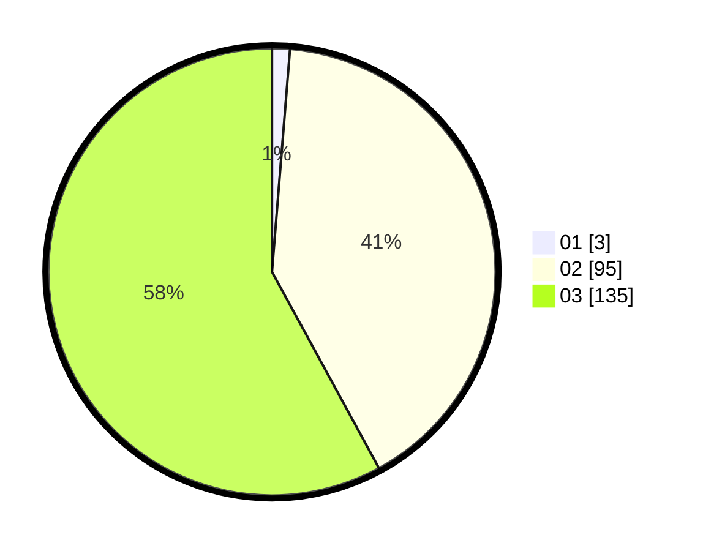

# Hasil

Hasil perolehan suara paslon dapat dilihat pada file paslon-01.txt, paslon-02.txt, dan paslon-03.txt.

Jika tidak ada, artinya data tersebut belum ada pada SIREKAP.

## Perolehan Suara

 * Paslon 01: **3**.
 * Paslon 02: **95**.
 * Paslon 03: **135**.

## Foto C Plano

https://sirekap-obj-formc.kpu.go.id/a992/pemilu/ppwp/31/72/06/10/02/3172061002099-20240214-190058--82eaed29-f1c1-486d-8f5e-2a4465410db3.jpg

https://sirekap-obj-formc.kpu.go.id/a992/pemilu/ppwp/31/72/06/10/02/3172061002099-20240214-192713--5af8f3f8-5176-4cad-a0e7-8fb09d61ce3c.jpg

https://sirekap-obj-formc.kpu.go.id/a992/pemilu/ppwp/31/72/06/10/02/3172061002099-20240214-192840--662cb75f-f839-4561-bd69-feafd4f4809f.jpg

## DATA PEMILIH TETAP

Jumlah pemilih dalam DPT: **289**.
 * L: **129**.
 * P: **160**.

## DATA PENGGUNA HAK PILIH

Jumlah pengguna hak pilih dalam DPT: **219**.
 * L: **92**.
 * P: **127**.

Jumlah pengguna hak pilih dalam DPTb: **6**.
 * L: **2**.
 * P: **4**.

Jumlah pengguna hak pilih dalam DPK: **8**.
 * L: **4**.
 * P: **4**.

Jumlah pengguna hak pilih: **233**.
 * L: **98**.
 * P: **135**.

## JUMLAH SUARA SAH DAN TIDAK SAH

JUMLAH SELURUH SUARA SAH: **233**.

JUMLAH SUARA TIDAK SAH: **0**.

JUMLAH SELURUH SUARA SAH DAN SUARA TIDAK SAH: **233**.
