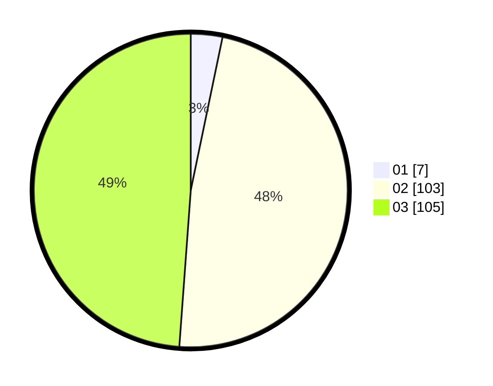

# Hasil

Hasil perolehan suara paslon dapat dilihat pada file paslon-01.txt, paslon-02.txt, dan paslon-03.txt.

Jika tidak ada, artinya data tersebut belum ada pada SIREKAP.

## Perolehan Suara

 * Paslon 01: **7**.
 * Paslon 02: **103**.
 * Paslon 03: **105**.

## Foto C Plano

https://sirekap-obj-formc.kpu.go.id/8326/pemilu/ppwp/31/72/06/10/02/3172061002110-20240216-144901--3cc50554-2185-4ed6-ada7-ce238fbd9fb2.jpg

https://sirekap-obj-formc.kpu.go.id/8326/pemilu/ppwp/31/72/06/10/02/3172061002110-20240216-144903--179cd640-014f-4f97-b4be-e126e659b3a5.jpg

https://sirekap-obj-formc.kpu.go.id/8326/pemilu/ppwp/31/72/06/10/02/3172061002110-20240216-144902--5df215d6-a29e-48ab-b085-92c6b5635a72.jpg

## DATA PEMILIH TETAP

Jumlah pemilih dalam DPT: **295**.
 * L: **136**.
 * P: **159**.

## DATA PENGGUNA HAK PILIH

Jumlah pengguna hak pilih dalam DPT: **208**.
 * L: **101**.
 * P: **107**.

Jumlah pengguna hak pilih dalam DPTb: **5**.
 * L: **2**.
 * P: **3**.

Jumlah pengguna hak pilih dalam DPK: **5**.
 * L: **2**.
 * P: **3**.

Jumlah pengguna hak pilih: **218**.
 * L: **105**.
 * P: **113**.

## JUMLAH SUARA SAH DAN TIDAK SAH

JUMLAH SELURUH SUARA SAH: **215**.

JUMLAH SUARA TIDAK SAH: **3**.

JUMLAH SELURUH SUARA SAH DAN SUARA TIDAK SAH: **218**.
