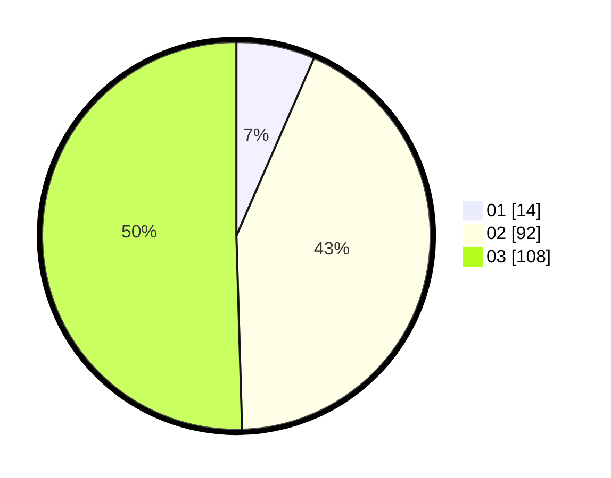

# Hasil

Hasil perolehan suara paslon dapat dilihat pada file paslon-01.txt, paslon-02.txt, dan paslon-03.txt.

Jika tidak ada, artinya data tersebut belum ada pada SIREKAP.

## Perolehan Suara

 * Paslon 01: **14**.
 * Paslon 02: **92**.
 * Paslon 03: **108**.

## Foto C Plano

https://sirekap-obj-formc.kpu.go.id/2b82/pemilu/ppwp/31/72/06/10/02/3172061002148-20240214-155054--acbec9a5-6dbc-4e58-8433-d71cf9747b5a.jpg

https://sirekap-obj-formc.kpu.go.id/2b82/pemilu/ppwp/31/72/06/10/02/3172061002148-20240214-155118--557776d8-9245-46ab-b4bf-60eb3c80a854.jpg

https://sirekap-obj-formc.kpu.go.id/2b82/pemilu/ppwp/31/72/06/10/02/3172061002148-20240214-155125--14e45fc7-036c-4c81-be87-086b3444541e.jpg

## DATA PEMILIH TETAP

Jumlah pemilih dalam DPT: **277**.
 * L: **122**.
 * P: **155**.

## DATA PENGGUNA HAK PILIH

Jumlah pengguna hak pilih dalam DPT: **188**.
 * L: **85**.
 * P: **103**.

Jumlah pengguna hak pilih dalam DPTb: **6**.
 * L: **1**.
 * P: **5**.

Jumlah pengguna hak pilih dalam DPK: **20**.
 * L: **9**.
 * P: **11**.

Jumlah pengguna hak pilih: **214**.
 * L: **95**.
 * P: **119**.

## JUMLAH SUARA SAH DAN TIDAK SAH

JUMLAH SELURUH SUARA SAH: **214**.

JUMLAH SUARA TIDAK SAH: **0**.

JUMLAH SELURUH SUARA SAH DAN SUARA TIDAK SAH: **214**.
