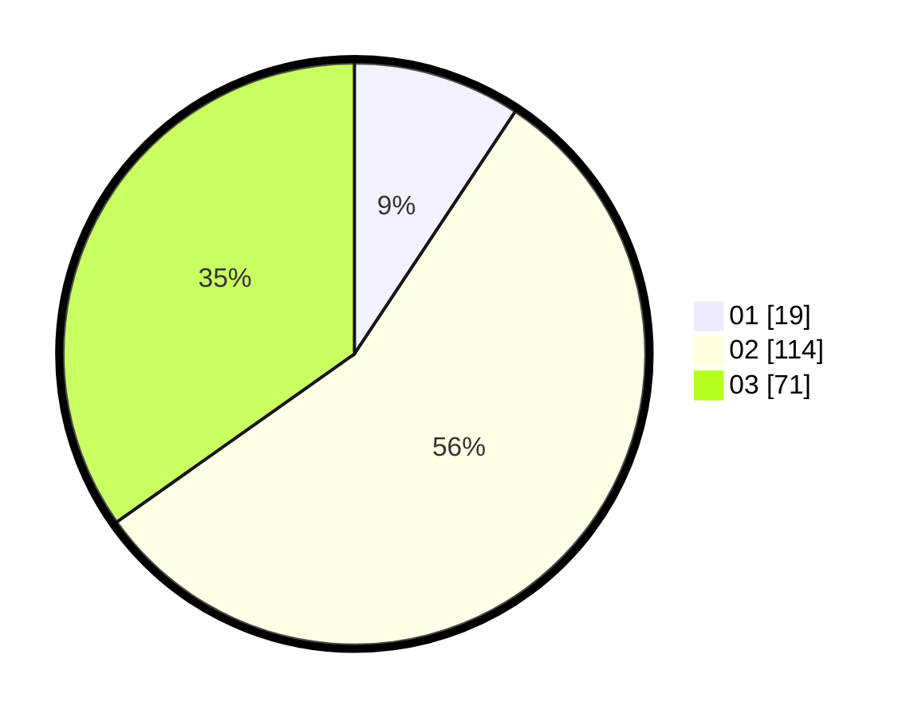

# Hasil

Hasil perolehan suara paslon dapat dilihat pada file paslon-01.txt, paslon-02.txt, dan paslon-03.txt.

Jika tidak ada, artinya data tersebut belum ada pada SIREKAP.

## Perolehan Suara

 * Paslon 01: **19**.
 * Paslon 02: **114**.
 * Paslon 03: **71**.

## Foto C Plano

https://sirekap-obj-formc.kpu.go.id/fbd7/pemilu/ppwp/31/72/06/10/02/3172061002167-20240214-215702--0d70c388-8bfe-4eb7-8ca8-7cc4530bd853.jpg

https://sirekap-obj-formc.kpu.go.id/fbd7/pemilu/ppwp/31/72/06/10/02/3172061002167-20240214-194122--f9a705e8-efaa-45e2-954c-def112b48374.jpg

https://sirekap-obj-formc.kpu.go.id/fbd7/pemilu/ppwp/31/72/06/10/02/3172061002167-20240214-194154--48a20726-fb7f-4688-be43-44b771e985f9.jpg
